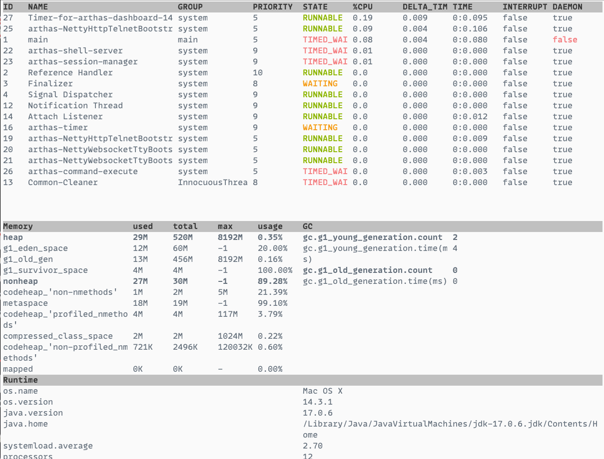

Alibaba 开源的 Java 诊断工具 Arthas 使用记录。

<!--more-->

## 开始

```shell
## 下载启动测试程序
curl -O https://arthas.aliyun.com/math-game.jar
java -jar math-game.jar

# 下载启动 arthas
curl -O https://arthas.aliyun.com/arthas-boot.jar
java -jar arthas-boot.jar
```

## 表达式核心变量

无论是匹配表达式也好、观察表达式也罢，他们核心判断变量都是围绕着一个 Arthas 中的通用通知对象 `Advice` 进行。

它的简略代码结构如下

```java
public class Advice {

    private final ClassLoader loader;
    private final Class<?> clazz;
    private final ArthasMethod method;
    private final Object target;
    private final Object[] params;
    private final Object returnObj;
    private final Throwable throwExp;
    private final boolean isBefore;
    private final boolean isThrow;
    private final boolean isReturn;

    // getter/setter
}
```

这里列一个表格来说明不同变量的含义

|    变量名 | 变量解释                                                                                                                                                                       |
| --------: | ------------------------------------------------------------------------------------------------------------------------------------------------------------------------------ |
|    loader | 本次调用类所在的 ClassLoader                                                                                                                                                   |
|     clazz | 本次调用类的 Class 引用                                                                                                                                                        |
|    method | 本次调用方法反射引用                                                                                                                                                           |
|    target | 本次调用类的实例                                                                                                                                                               |
|    params | 本次调用参数列表，这是一个数组，如果方法是无参方法则为空数组                                                                                                                   |
| returnObj | 本次调用返回的对象。当且仅当 isReturn==true 成立时候有效，表明方法调用是以正常返回的方式结束。如果当前方法无返回值 void，则值为 null                                           |
|  throwExp | 本次调用抛出的异常。当且仅当 isThrow==true 成立时有效，表明方法调用是以抛出异常的方式结束。                                                                                    |
|  isBefore | 辅助判断标记，当前的通知节点有可能是在方法一开始就通知，此时 isBefore==true 成立，同时 isThrow==false 和 isReturn==false，因为在方法刚开始时，还无法确定方法调用将会如何结束。 |
|   isThrow | 辅助判断标记，当前的方法调用以抛异常的形式结束。                                                                                                                               |
|  isReturn | 辅助判断标记，当前的方法调用以正常返回的形式结束。                                                                                                                             |

所有变量都可以在表达式中直接使用，如果在表达式中编写了不符合 OGNL 脚本语法或者引入了不在表格中的变量，则退出命令的执行；用户可以根据当前的异常信息修正 `条件表达式 `或 `观察表达式`。

## 基础命令

### help

查看命令帮助信息，可以查看当前 arthas 版本支持的指令，或者查看具体指令的使用说明。

| 参数名称 | 参数说明                                   |
| -------: | ------------------------------------------ |
| 不接参数 | 查询当前 arthas 版本支持的指令以及指令描述 |
|  [name:] | 查询具体指令的使用说明                     |

```shell
$ help
 NAME         DESCRIPTION
 help         Display Arthas Help
 auth         Authenticates the current session
 keymap       Display all the available keymap for the specified connection.
 sc           Search all the classes loaded by JVM
 sm           Search the method of classes loaded by JVM
 classloader  Show classloader info
 jad          Decompile class
 getstatic    Show the static field of a class
 monitor      Monitor method execution statistics, e.g. total/success/failure count, average rt, fail rate, etc.
 stack        Display the stack trace for the specified class and method
 thread       Display thread info, thread stack
 trace        Trace the execution time of specified method invocation.
 watch        Display the input/output parameter, return object, and thrown exception of specified method invocation
 tt           Time Tunnel
 jvm          Display the target JVM information
 memory       Display jvm memory info.
 perfcounter  Display the perf counter information.
 ognl         Execute ognl expression.
 mc           Memory compiler, compiles java files into bytecode and class files in memory.
 redefine     Redefine classes. @see Instrumentation#redefineClasses(ClassDefinition...)
 retransform  Retransform classes. @see Instrumentation#retransformClasses(Class...)
 dashboard    Overview of target jvm's thread, memory, gc, vm, tomcat info.
 dump         Dump class byte array from JVM
 heapdump     Heap dump
 options      View and change various Arthas options
 cls          Clear the screen
 reset        Reset all the enhanced classes
 version      Display Arthas version
 session      Display current session information
 sysprop      Display and change the system properties.
 sysenv       Display the system env.
 vmoption     Display, and update the vm diagnostic options.
 logger       Print logger info, and update the logger level
 history      Display command history
 cat          Concatenate and print files
 base64       Encode and decode using Base64 representation
 echo         write arguments to the standard output
 pwd          Return working directory name
 mbean        Display the mbean information
 grep         grep command for pipes.
 tee          tee command for pipes.
 profiler     Async Profiler. https://github.com/jvm-profiling-tools/async-profiler
 vmtool       jvm tool
 stop         Stop/Shutdown Arthas server and exit the console.
 jfr          Java Flight Recorder Command
```

```shell
$ help dashboard
 USAGE:
   dashboard [-h] [-i <value>] [-n <value>]

 SUMMARY:
   Overview of target jvm's thread, memory, gc, vm, tomcat info.

 EXAMPLES:
   dashboard
   dashboard -n 10
   dashboard -i 2000

 WIKI:
   https://arthas.aliyun.com/doc/dashboard

 OPTIONS:
 -h, --help                              this help
 -i, --interval <value>                  The interval (in ms) between two executions, default is 5000 ms.
 -n, --number-of-execution <value>       The number of times this command will be executed.
```

### cls

清空当前屏幕区域。

### session

查看当前会话的信息，显示当前绑定的 pid 以及会话 id。

> **提示**
>
> 如果配置了 tunnel server，会追加打印 代理 id、tunnel 服务器的 url 以及连接状态。
>
> 如果使用了 staturl 做统计，会追加显示 statUrl 地址。

```shell
$ session
 Name        Value
--------------------------------------------------
 JAVA_PID    96956
 SESSION_ID  14219aff-0255-4e7d-aaa8-244061bd8277
```

### reset

> **提示**
>
> 重置增强类，将被 Arthas 增强过的类全部还原，Arthas 服务端 stop 时会重置所有增强过的类

```shell
# 还原指定类
reset Test
# 还原所有类
reset
```

### version

输出当前目标 Java 进程所加载的 Arthas 版本号

```shell
$ version
3.7.2
```

### history

打印命令历史。

> **提示**
>
> 历史指令会通过一个名叫 history 的文件持久化，所以 history 指令可以查看当前 arthas 服务器的所有历史命令，而不仅只是当前次会话使用过的命令。

| 参数名称 | 参数说明                |
| -------: | ----------------------- |
|     [c:] | 清空历史指令            |
|     [n:] | 显示最近执行的 n 条指令 |

### quit-stop

退出当前 Arthas 客户端，其他 Arthas 客户端不受影响。等同于 exit、logout、q 三个指令。

> **提示**
>
> 只是退出当前 Arthas 客户端，Arthas 的服务器端并没有关闭，所做的修改也不会被重置。

### keymap

`keymap` 命令输出当前的快捷键映射表：

| 快捷键      | 快捷键说明       | 命令名称             | 命令说明                         |
| ----------- | ---------------- | -------------------- | -------------------------------- |
| "\C-a"      | ctrl + a         | beginning-of-line    | 跳到行首                         |
| "\C-e"      | ctrl + e         | end-of-line          | 跳到行尾                         |
| "\C-f"      | ctrl + f         | forward-word         | 向前移动一个单词                 |
| "\C-b"      | ctrl + b         | backward-word        | 向后移动一个单词                 |
| "\e[D"      | 键盘左方向键     | backward-char        | 光标向前移动一个字符             |
| "\e[C"      | 键盘右方向键     | forward-char         | 光标向后移动一个字符             |
| "\e[B"      | 键盘下方向键     | next-history         | 下翻显示下一个命令               |
| "\e[A"      | 键盘上方向键     | previous-history     | 上翻显示上一个命令               |
| "\C-h"      | ctrl + h         | backward-delete-char | 向后删除一个字符                 |
| "\C-?"      | ctrl + shift + / | backward-delete-char | 向后删除一个字符                 |
| "\C-u"      | ctrl + u         | undo                 | 撤销上一个命令，相当于清空当前行 |
| "\C-d"      | ctrl + d         | delete-char          | 删除当前光标所在字符             |
| "\C-k"      | ctrl + k         | kill-line            | 删除当前光标到行尾的所有字符     |
| "\C-i"      | ctrl + i         | complete             | 自动补全，相当于敲 TAB           |
| "\C-j"      | ctrl + j         | accept-line          | 结束当前行，相当于敲回车         |
| "\C-m"      | ctrl + m         | accept-line          | 结束当前行，相当于敲回车         |
| "\C-w"      | -                | backward-delete-word | -                                |
| "\C-x\e[3~" | -                | backward-kill-line   | -                                |
| "\e\C-?"    | -                | backward-kill-word   | -                                |

- 任何时候 tab 键，会根据当前的输入给出提示
- 命令后敲 - 或 -- ，然后按 tab 键，可以展示出此命令具体的选项

#### 自定义快捷键

在当前用户目录下新建 `$USER_HOME/.arthas/conf/inputrc` 文件，加入自定义配置。

#### 后台异步命令相关快捷键

ctrl + c: 终止当前命令
ctrl + z: 挂起当前命令，后续可以 bg/fg 重新支持此命令，或 kill 掉
ctrl + a: 回到行首
ctrl + e: 回到行尾

### cat

> **提示**
>
> 打印文件内容，和 linux 里的 cat 命令类似。

### echo

> **提示**
>
> 打印参数，和 linux 里的 echo 命令类似。

### grep

> **提示**
>
> 类似传统的 grep 命令。

### tee

> **提示**
>
> 类似传统的 tee 命令, 用于读取标准输入的数据，并将其内容输出成文件。
>
> tee 指令会从标准输入设备读取数据，将其内容输出到标准输出设备，同时保存成文件。

### pwd

> **提示**
>
> 返回当前的工作目录，和 linux 命令类似

### plaintext

### wc

### options

> **提示**
>
> 全局开关

| 名称                   | 默认值 | 描述                                                                                                                                                     |
| ---------------------- | ------ | -------------------------------------------------------------------------------------------------------------------------------------------------------- |
| unsafe                 | false  | 是否支持对系统级别的类进行增强，打开该开关可能导致把 JVM 搞挂，请慎重选择！                                                                              |
| dump                   | false  | 是否支持被增强了的类 dump 到外部文件中，如果打开开关，class 文件会被 dump 到/${application working dir}/arthas-class-dump/目录下，具体位置详见控制台输出 |
| batch-re-transform     | true   | 是否支持批量对匹配到的类执行 retransform 操作                                                                                                            |
| json-format            | false  | 是否支持 json 化的输出                                                                                                                                   |
| disable-sub-class      | false  | 是否禁用子类匹配，默认在匹配目标类的时候会默认匹配到其子类，如果想精确匹配，可以关闭此开关                                                               |
| support-default-method | true   | 是否支持匹配到 default method， 默认会查找 interface，匹配里面的 default method。参考 #1105 在新窗口打开                                                 |
| save-result            | false  | 是否打开执行结果存日志功能，打开之后所有命令的运行结果都将保存到~/logs/arthas-cache/result.log 中                                                        |
| job-timeout            | 1d     | 异步后台任务的默认超时时间，超过这个时间，任务自动停止；比如设置 1d, 2h, 3m, 25s，分别代表天、小时、分、秒                                               |
| print-parent-fields    | true   | 是否打印在 parent class 里的 filed                                                                                                                       |
| verbose                | false  | 是否打印更多详细信息                                                                                                                                     |
| strict                 | true   | 是否启用 strict 模式                                                                                                                                     |

```shell
# 查看所有的 options
options
# 获取 option 的值
options json-format
# 设置指定的 option
options save-result true
```

> **提示**
>
> 默认情况下 `json-format` 为 false，如果希望 `watch`/`tt` 等命令结果以 json 格式输出，则可以设置 `json-format` 为 true。

#### 打开 unsafe 开关，支持 jdk package 下的类

默认情况下，`watch`/`trace`/`tt`/`trace`/`monitor` 等命令不支持 `java.\*` package 下的类。可以设置 `unsafe` 为 true，则可以增强。

```shell
options unsafe true
```

#### 关闭 strict 模式，允许在 ognl 表达式里设置对象属性

> **提示**
>
> since 3.6.0

对于新用户，在编写 ognl 表达式时，可能会出现误用。

比如对于 `Student`，判断年龄等于 18 时，可能条件表达式会误写为 `target.age=18`，这个表达式实际上是把当前对象的 `age` 设置为 18 了。正确的写法是 `target.age==18`。

为了防止出现类似上面的误用，Arthas 默认启用 `strict` 模式，在 `ognl` 表达式里，禁止更新对象的 Property 或者调用 `setter` 函数。

以 `MathGame` 为例，会出现以下的错误提示。

```shell
$ watch demo.MathGame primeFactors 'target' 'target.illegalArgumentCount=1'
Press Q or Ctrl+C to abort.
Affect(class count: 1 , method count: 1) cost in 20 ms, listenerId: 6
watch failed, condition is: target.illegalArgumentCount=1, express is: target, By default, strict mode is true, not allowed to set object properties. Want to set object properties, execute `options strict false`, visit /Users/lucaschen/logs/arthas/arthas.log for more details.
```

用户如果确定要在 `ognl` 表达式里更新对象，可以执行 `options strict false`，关闭 strict 模式。

## 系统命令

### dashboard

> **提示**

当前系统的实时数据面板，按 ctrl+c 退出。

当运行在 Ali-tomcat 时，会显示当前 tomcat 的实时信息，如 HTTP 请求的 qps, rt, 错误数, 线程池信息等等。

| 参数名称 | 参数说明                                 |
| -------: | ---------------------------------------- |
|     [i:] | 刷新实时数据的时间间隔 (ms)，默认 5000ms |
|     [n:] | 刷新实时数据的次数                       |



#### 数据说明

- ID: Java 级别的线程 ID，注意这个 ID 不能跟 jstack 中的 nativeID 一一对应。
- NAME: 线程名
- GROUP: 线程组名
- PRIORITY: 线程优先级, 1~10 之间的数字，越大表示优先级越高
- STATE: 线程的状态
- CPU%: 线程的 cpu 使用率。比如采样间隔 1000ms，某个线程的增量 cpu 时间为 100ms，则 cpu 使用率=100/1000=10%
- DELTA_TIME: 上次采样之后线程运行增量 CPU 时间，数据格式为`秒`
- TIME: 线程运行总 CPU 时间，数据格式为`分:秒`
- INTERRUPTED: 线程当前的中断位状态
- DAEMON: 是否是 daemon 线程

#### JVM 内部线程

Java 8 之后支持获取 JVM 内部线程 CPU 时间，这些线程只有名称和 CPU 时间，没有 ID 及状态等信息（显示 ID 为-1）。 通过内部线程可以观测到 JVM 活动，如 GC、JIT 编译等占用 CPU 情况，方便了解 JVM 整体运行状况。

- 当 JVM 堆(heap)/元数据(metaspace)空间不足或 OOM 时，可以看到 GC 线程的 CPU 占用率明显高于其他的线程。
- 当执行 `trace/watch/tt/redefine` 等命令后，可以看到 JIT 线程活动变得更频繁。因为 JVM 热更新 class 字节码时清除了此 class 相关的 JIT 编译结果，需要重新编译。

JVM 内部线程包括下面几种：

- JIT 编译线程: 如 `C1 CompilerThread0`, `C2 CompilerThread0`
- GC 线程: 如 `GC Thread0`, `G1 Young RemSet Sampling`
- 其它内部线程: 如 `VM Periodic Task Thread`, `VM Thread`, `Service Thread`

### thread

> **提示**
>
> 查看当前线程信息，查看线程的堆栈

|          参数名称 | 参数说明                                                |
| ----------------: | ------------------------------------------------------- |
|                id | 线程 id                                                 |
|              [n:] | 指定最忙的前 N 个线程并打印堆栈                         |
|               [b] | 找出当前阻塞其他线程的线程                              |
| [i &lt;value&gt;] | 指定 cpu 使用率统计的采样间隔，单位为毫秒，默认值为 200 |
|           [--all] | 显示所有匹配的线程                                      |

这里的 cpu 使用率与 linux 命令 `top -H -p <pid>` 的线程 `%CPU` 类似，一段采样间隔时间内，当前 JVM 里各个线程的增量 cpu 时间与采样间隔时间的比例。

工作原理说明：

- 首先第一次采样，获取所有线程的 CPU 时间(调用的是 `java.lang.management.ThreadMXBean#getThreadCpuTime()` 及 `sun.management.HotspotThreadMBean.getInternalThreadCpuTimes()` 接口)
- 然后睡眠等待一个间隔时间（默认为 200ms，可以通过 `-i` 指定间隔时间）
- 再次第二次采样，获取所有线程的 CPU 时间，对比两次采样数据，计算出每个线程的增量 CPU 时间
- 线程 CPU 使用率 = 线程增量 CPU 时间 / 采样间隔时间 \* 100%

> **注意**
>
> 注意： 这个统计也会产生一定的开销（JDK 这个接口本身开销比较大），因此会看到 as 的线程占用一定的百分比，为了降低统计自身的开销带来的影响，可以把采样间隔拉长一些，比如 5000 毫秒。
>
> **提示**
>
> 另外一种查看 Java 进程的线程 cpu 使用率方法：可以使用 show-busy-java-threads 这个脚本

```shell
# 一键展示当前最忙的前 N 个线程并打印堆栈
thread -n 3
```

- 没有线程 ID，包含 `[Internal]`表示为 JVM 内部线程，参考 [dashboard](#dashboard) 命令的介绍。
- `cpuUsage` 为采样间隔时间内线程的 CPU 使用率，与 [dashboard](#dashboard) 命令的数据一致。
- `deltaTime` 为采样间隔时间内线程的增量 CPU 时间，小于 1ms 时被取整显示为 0ms。
- `time` 线程运行总 CPU 时间。

注意：线程栈为第二采样结束时获取，不能表明采样间隔时间内该线程都是在处理相同的任务。建议间隔时间不要太长，可能间隔时间越大越不准确。 可以根据具体情况尝试指定不同的间隔时间，观察输出结果。

```shell
# 当没有参数时，显示第一页线程的信息
# 默认按照 CPU 增量时间降序排列，只显示第一页数据。
thread

# 显示所有匹配线程信息，有时需要获取全部 JVM 的线程数据进行分析。
thread --all

# thread id, 显示指定线程的运行堆栈
thread 1

# thread -b, 找出当前阻塞其他线程的线程
# 有时候我们发现应用卡住了， 通常是由于某个线程拿住了某个锁， 并且其他线程都在等待这把锁造成的。 为了排查这类问题， arthas 提供了 thread -b， 一键找出那个罪魁祸首
# **注意**
# 注意， 目前只支持找出 synchronized 关键字阻塞住的线程， 如果是java.util.concurrent.Lock， 目前还不支持
thread -b

# thread -i, 指定采样时间间隔
# 统计最近 1000ms 内的线程 CPU 时间
thread -i 1000
# 列出 1000ms 内最忙的 3 个线程栈
thread -n 3 -i 1000

# thread --state ，查看指定状态的线程
# NEW, RUNNABLE, BLOCKED, WAITING, TIMED_WAITING, TERMINATED
thread --state WAITING
```

### jvm

> **提示**
>
> 查看当前 JVM 信息

THREAD 相关:

- COUNT: JVM 当前活跃的线程数
- DAEMON-COUNT: JVM 当前活跃的守护线程数
- PEAK-COUNT: 从 JVM 启动开始曾经活着的最大线程数
- STARTED-COUNT: 从 JVM 启动开始总共启动过的线程次数
- DEADLOCK-COUNT: JVM 当前死锁的线程数

文件描述符相关:

- MAX-FILE-DESCRIPTOR-COUNT：JVM 进程最大可以打开的文件描述符数
- OPEN-FILE-DESCRIPTOR-COUNT：JVM 当前打开的文件描述符数

### sysprop

> **提示**
>
> 查看当前 JVM 的系统属性(System Property)

```shell
# 查看所有属性
sysprop

# 查看单个属性, 支持通过TAB键自动补全
sysprop java.version

# 修改单个属性
sysprop user.country CN
```

### sysenv

> **提示**
>
> 查看当前 JVM 的环境属性(System Environment Variables)

```shell
# 查看所有环境变量
sysenv

# 查看单个环境变量, 支持通过TAB键自动补全
sysenv java.version
```

### vmoption

> **提示**
>
> 查看，更新 VM 诊断相关的参数

```shell
# 查看所有的 option
vmoption

# 查看指定的 option
vmoption PrintGC

# 更新指定的 option
vmoption PrintGCDetails true
```

### vmtool

> **提示**
>
> @since 3.5.1

`vmtool` 利用 `JVMTI` 接口，实现查询内存对象，强制 GC 等功能。

```shell
# 获取对象
# 通过 --limit参数，可以限制返回值数量，避免获取超大数据时对 JVM 造成压力。默认值是 10。
vmtool --action getInstances --className java.lang.String --limit 10

# 指定 classloader name
vmtool --action getInstances --classLoaderClass org.springframework.boot.loader.LaunchedURLClassLoader --className org.springframework.context.ApplicationContext

# 指定 classloader hash
#可以通过sc命令查找到加载 class 的 classloader。
sc -d org.springframework.context.ApplicationContext
 class-info        org.springframework.boot.context.embedded.AnnotationConfigEmbeddedWebApplicationContext
 code-source       file:/private/tmp/demo-arthas-spring-boot.jar!/BOOT-INF/lib/spring-boot-1.5.13.RELEASE.jar!/
 name              org.springframework.boot.context.embedded.AnnotationConfigEmbeddedWebApplicationContext
...
 class-loader      +-org.springframework.boot.loader.LaunchedURLClassLoader@19469ea2
                     +-sun.misc.Launcher$AppClassLoader@75b84c92
                       +-sun.misc.Launcher$ExtClassLoader@4f023edb
 classLoaderHash   19469ea2
# 然后用-c/--classloader 参数指定：
vmtool --action getInstances -c 19469ea2 --className org.springframework.context.ApplicationContext

# 指定返回结果展开层数
# getInstances action 返回结果绑定到instances变量上，它是数组。
# 通过 -x/--expand 参数可以指定结果的展开层次，默认值是 1。
vmtool --action getInstances -c 19469ea2 --className org.springframework.context.ApplicationContext -x 2

# 执行表达式
# getInstances action 返回结果绑定到instances变量上，它是数组。可以通过--express参数执行指定的表达式。
vmtool --action getInstances --classLoaderClass org.springframework.boot.loader.LaunchedURLClassLoader --className org.springframework.context.ApplicationContext --express 'instances[0].getBeanDefinitionNames()'

# 强制 GC
# 可以结合 vmoption 命令动态打开PrintGC开关
vmtool --action forceGc

# interrupt 指定线程
# thread id 通过-t参数指定，可以使用 thread 命令获取。
vmtool --action interruptThread -t 1
```

### perfcounter

> **提示**
>
> 查看当前 JVM 的 Perf Counter 信息

```shell
perfcounter
# 可以用-d参数打印更多信息：
perfcounter -d
```

jdk9 以上的应用,如果没有打印出信息，应用在启动时，加下面的参数：

```shell
--add-opens java.base/jdk.internal.perf=ALL-UNNAMED --add-exports java.base/jdk.internal.perf=ALL-UNNAMED --add-opens java.management/sun.management.counter.perf=ALL-UNNAMED --add-opens java.management/sun.management.counter=ALL-UNNAMED
```

### logger

> **提示**
>
> 查看 logger 信息，更新 logger level

```shell
# 更新 logger level
logger --name ROOT --level debug
```

### getstatic

```shell
# 通过 getstatic 命令可以方便的查看类的静态属性。使用方法为 `getstatic class_name field_name`
getstatic demo.MathGame random

# 注意 hashcode 是变化的，需要先查看当前的 ClassLoader 信息，使用sc -d <ClassName>提取对应 ClassLoader 的 hashcode。
# 如果你使用-c，你需要手动输入 hashcode：-c <hashcode>
getstatic -c 3d4eac69 demo.MathGame random
# 对于只有唯一实例的 ClassLoader 可以通过--classLoaderClass指定 class name，使用起来更加方便：
getstatic --classLoaderClass sun.misc.Launcher$AppClassLoader demo.MathGame random
```

### ognl

> **提示**
>
> 执行 ognl 表达式

|            参数名称 | 参数说明                                                         |
| ------------------: | ---------------------------------------------------------------- |
|             express | 执行的表达式                                                     |
|                [c:] | 执行表达式的 ClassLoader 的 hashcode，默认值是 SystemClassLoader |
| [classLoaderClass:] | 指定执行表达式的 ClassLoader 的 class name                       |
|                 [x] | 结果对象的展开层次，默认值 1                                     |

```shell
# 调用静态函数：
ognl '@java.lang.System@out.println("hello")'
# 获取静态类的静态字段：
ognl '@demo.MathGame@random'
# 执行多行表达式，赋值给临时变量，返回一个 List：
$ ognl '#value1=@System@getProperty("java.home"), #value2=@System@getProperty("java.runtime.name"), {#value1, #value2}'
```

arthas 中的特殊用法：

```shell
# 查看第一个参数：
watch com.taobao.container.Test test "params[0]"

# 查看第一个参数的 size：
watch com.taobao.container.Test test "params[0].size()"

# 将结果按 name 属性投影：
watch com.taobao.container.Test test "params[0].{ #this.name }"

# 按条件过滤：
watch com.taobao.container.Test test "params[0].{? #this.name == null }.size() > 0" -x 2

# 过滤后统计：
watch com.taobao.container.Test test "params[0].{? #this.age > 10 }.size()" -x 2

# 判断字符串相等
watch com.demo.Test test 'params[0]=="xyz"'

# 判断 long 型
watch com.demo.Test test 'params[0]==123456789L'

# 子表达式求值：
watch com.taobao.container.Test test "params[0].{? #this.age > 10 }.size().(#this > 20 ? #this - 10 : #this + 10)" -x 2

# 选择第一个满足条件：
watch com.taobao.container.Test test "params[0].{^ #this.name != null}" -x 2

# 选择最后一个满足条件：
watch com.taobao.container.Test test "params[0].{$ #this.name != null}" -x 2


# 匹配线程 & 正则多个类多个方法
trace -E 'io\.netty\.channel\.nio\.NioEventLoop|io\.netty\.util\.concurrent\.SingleThreadEventExecutor'  'select|processSelectedKeys|runAllTasks' '@Thread@currentThread().getName().contains("IO-HTTP-WORKER-IOPool")&&#cost>500'

```

### mbean

> **提示**
>
> 查看 Mbean 的信息

这个命令可以便捷的查看或监控 Mbean 的属性信息。

|          参数名称 | 参数说明                                             |
| ----------------: | ---------------------------------------------------- |
|      name-pattern | 名称表达式匹配                                       |
| attribute-pattern | 属性名表达式匹配                                     |
|               [m] | 查看元信息                                           |
|              [i:] | 刷新属性值的时间间隔 (ms)                            |
|              [n:] | 刷新属性值的次数                                     |
|               [E] | 开启正则表达式匹配，默认为通配符匹配。仅对属性名有效 |

```shell
# 列出所有 Mbean 的名称：
mbean

# 查看 Mbean 的元信息：
mbean -m java.lang:type=Threading

# 查看 mbean 属性信息：
mbean java.lang:type=Threading

# mbean 的 name 支持通配符匹配：
# 注意：ObjectName 的匹配规则与正常的通配符存在差异，详细参见：[javax.management.ObjectName](https://docs.oracle.com/javase/8/docs/api/javax/management/ObjectName.html?is-external=true)
mbean java.lang:type=Th*

# 通配符匹配特定的属性字段：
mbean java.lang:type=Threading *Count

# 使用 -E 命令切换为正则匹配：
mbean -E java.lang:type=Threading PeakThreadCount|ThreadCount|DaemonThreadCount

# 使用 -i 命令实时监控：
mbean -i 1000 java.lang:type=Threading *Count

# 实时监控使用 -i，使用 -n 命令执行命令的次数（默认为 100 次）：
mbean -i 1000 -n 50 java.lang:type=Threading *Count
```

### heapdump

> **提示**
>
> dump java heap, 类似 jmap 命令的 heap dump 功能。

```shell
# dump 到指定文件
# 生成文件在arthas-output目录，可以通过浏览器下载： http://localhost:8563/arthas-output/
heapdump arthas-output/dump.hprof

# 只 dump live 对象
heapdump --live /tmp/dump.hprof

# dump 到临时文件
heapdump
```

## 类命令

### sc

> **提示**
>
> 查看 JVM 已加载的类信息

“Search-Class” 的简写，这个命令能搜索出所有已经加载到 JVM 中的 Class 信息，这个命令支持的参数有 `[d]`、`[E]`、`[f]` 和 `[x:]`。

|            参数名称 | 参数说明                                                                                                                                         |
| ------------------: | ------------------------------------------------------------------------------------------------------------------------------------------------ |
|     _class-pattern_ | 类名表达式匹配                                                                                                                                   |
|    _method-pattern_ | 方法名表达式匹配                                                                                                                                 |
|                 [d] | 输出当前类的详细信息，包括这个类所加载的原始文件来源、类的声明、加载的 ClassLoader 等详细信息。如果一个类被多个 ClassLoader 所加载，则会出现多次 |
|                 [E] | 开启正则表达式匹配，默认为通配符匹配                                                                                                             |
|                 [f] | 输出当前类的成员变量信息（需要配合参数-d 一起使用）                                                                                              |
|                [x:] | 指定输出静态变量时属性的遍历深度，默认为 0，即直接使用 toString 输出                                                                             |
|                [c:] | 指定 class 的 ClassLoader 的 hashcode                                                                                                            |
| [classLoaderClass:] | 指定执行表达式的 ClassLoader 的 class name                                                                                                       |
|                [n:] | 具有详细信息的匹配类的最大数量（默认为 100）                                                                                                     |
|    [cs &lt;arg&gt;] | 指定 class 的 ClassLoader#toString() 返回值。长格式[classLoaderStr &lt;arg&gt;]                                                                  |

> _提示_
>
> class-pattern 支持全限定名，如 `com.taobao.test.AAA`，也支持 `com/taobao/test/AAA` 这样的格式，这样，我们从异常堆栈里面把类名拷贝过来的时候，不需要在手动把 `/` 替换为 `.` 啦。
>
> sc 默认开启了子类匹配功能，也就是说所有当前类的子类也会被搜索出来，想要精确的匹配，请打开 `options disable-sub-class true` 开关

```shell
# 模糊搜索
sc demo.*

# 打印类的详细信息
sc -d demo.MathGame

# 打印出类的 Field 信息
sc -d -f demo.MathGame

# 通过 ClassLoader#toString 查找类（前提：有一个 toString()返回值是apo的类加载器，加载的类中包含 `demo.MathGame`, `demo.MyBar`, `demo.MyFoo3` 个类）
sc -cs apo *demo*
```

### sm

> **提示**
>
> 查看已加载类的方法信息

“Search-Method” 的简写，这个命令能搜索出所有已经加载了 Class 信息的方法信息。

`sm` 命令只能看到由当前类所声明 (declaring) 的方法，父类则无法看到。

|            参数名称 | 参数说明                                     |
| ------------------: | -------------------------------------------- |
|     _class-pattern_ | 类名表达式匹配                               |
|    _method-pattern_ | 方法名表达式匹配                             |
|                 [d] | 展示每个方法的详细信息                       |
|                 [E] | 开启正则表达式匹配，默认为通配符匹配         |
|                [c:] | 指定 class 的 ClassLoader 的 hashcode        |
| [classLoaderClass:] | 指定执行表达式的 ClassLoader 的 class name   |
|                [n:] | 具有详细信息的匹配类的最大数量（默认为 100） |

```shell
sm java.lang.String
sm -d java.lang.String toString
```

### jad

> **提示**
>
> 反编译指定已加载类的源码

`jad` 命令将 JVM 中实际运行的 class 的 byte code 反编译成 java 代码，便于你理解业务逻辑；如需批量下载指定包的目录的 class 字节码可以参考 dump。

- 在 Arthas Console 上，反编译出来的源码是带语法高亮的，阅读更方便
- 当然，反编译出来的 java 代码可能会存在语法错误，但不影响你进行阅读理解

|            参数名称 | 参数说明                                   |
| ------------------: | ------------------------------------------ |
|     _class-pattern_ | 类名表达式匹配                             |
|                [c:] | 类所属 ClassLoader 的 hashcode             |
| [classLoaderClass:] | 指定执行表达式的 ClassLoader 的 class name |
|                 [E] | 开启正则表达式匹配，默认为通配符匹配       |

```shell
# 反编译java.lang.String
jad java.lang.String

# 反编译时只显示源代码
# 默认情况下，反编译结果里会带有 ClassLoader 信息，通过 --source-only 选项，可以只打印源代码。方便和 mc/retransform 命令结合使用
jad --source-only demo.MathGame

# 反编译指定的函数
jad demo.MathGame main

# 反编译时不显示行号
# --lineNumber 参数默认值为 true，显示指定为 false 则不打印行号。
jad demo.MathGame main --lineNumber false

# 反编译时指定 ClassLoader
# 当有多个 ClassLoader 都加载了这个类时，jad 命令会输出对应 ClassLoader 实例的 hashcode，然后你只需要重新执行 jad 命令，并使用参数 -c <hashcode> 就可以反编译指定 ClassLoader 加载的那个类了；
jad org.apache.log4j.Logger
# 对于只有唯一实例的 ClassLoader 还可以通过--classLoaderClass指定 class name，使用起来更加方便：
# --classLoaderClass 的值是 ClassLoader 的类名，只有匹配到唯一的 ClassLoader 实例时才能工作，目的是方便输入通用命令，而-c <hashcode>是动态变化的。
```

### mc-retransform

```shell
> **提示**
>
> 加载外部的.class文件，retransform jvm 已加载的类。
```

```shell
# retransform 指定的 .class 文件
# 加载指定的 .class 文件，然后解析出 class name，再 retransform jvm 中已加载的对应的类。每加载一个 .class 文件，则会记录一个 retransform entry.
# 如果多次执行 retransform 加载同一个 class 文件，则会有多条 retransform entry.
retransform /tmp/Test.class

# 查看 retransform entry
# TransformCount 统计在 ClassFileTransformer#transform 函数里尝试返回 entry 对应的 .class 文件的次数，但并不表明 transform 一定成功。
retransform -l

# 删除指定 retransform entry
# 需要指定 id：
retransform -d 1                    # delete retransform entry

# 删除所有 retransform entry
retransform --deleteAll             # delete all retransform entries

# 显式触发 retransform
# 注意：对于同一个类，当存在多个 retransform entry 时，如果显式触发 retransform ，则最后添加的 entry 生效(id 最大的)。
retransform --classPattern demo.*   # triger retransform classes


retransform -c 327a647b /tmp/Test.class /tmp/Test\$Inner.class
retransform --classLoaderClass 'sun.misc.Launcher$AppClassLoader' /tmp/Test.class
```

#### 如果对某个类执行 retransform 之后，想消除影响，则需要

- 删除这个类对应的 retransform entry
- 重新触发 retransform

> **提示**
>
> 如果不清除掉所有的 retransform entry，并重新触发 retransform ，则 arthas stop 时，retransform 过的类仍然生效。

#### 结合 jad/mc 命令使用

```shell
jad --source-only com.example.demo.arthas.user.UserController > /tmp/UserController.java

mc /tmp/UserController.java -d /tmp

retransform /tmp/com/example/demo/arthas/user/UserController.class
```

- jad 命令反编译，然后可以用其它编译器，比如 vim 来修改源码
- mc 命令来内存编译修改过的代码
- 用 retransform 命令加载新的字节码

#### 上传 .class 文件到服务器的技巧

使用 mc 命令来编译 jad 的反编译的代码有可能失败。可以在本地修改代码，编译好后再上传到服务器上。有的服务器不允许直接上传文件，可以使用 base64 命令来绕过。

1. 在本地先转换.class 文件为 base64，再保存为 result.txt

```shell
base64 < Test.class > result.txt
```

2. 到服务器上，新建并编辑 result.txt，复制本地的内容，粘贴再保存

3. 把服务器上的 result.txt 还原为.class

```shell
base64 -d < result.txt > Test.class
```

4. 用 md5 命令计算哈希值，校验是否一致

---

retransform 的限制

- 不允许新增加 field/method
- 正在跑的函数，没有退出不能生效，比如下面新增加的 `System.out.println`，只有 `run()` 函数里的会生效

```java
public class MathGame {
    public static void main(String[] args) throws InterruptedException {
        MathGame game = new MathGame();
        while (true) {
            game.run();
            TimeUnit.SECONDS.sleep(1);
            // 这个不生效，因为代码一直跑在 while里
            System.out.println("in loop");
        }
    }

    public void run() throws InterruptedException {
        // 这个生效，因为run()函数每次都可以完整结束
        System.out.println("call run()");
        try {
            int number = random.nextInt();
            List<Integer> primeFactors = primeFactors(number);
            print(number, primeFactors);

        } catch (Exception e) {
            System.out.println(String.format("illegalArgumentCount:%3d, ", illegalArgumentCount) + e.getMessage());
        }
    }
}
```

### mc-redefine

> **提示**
>
> 推荐使用 [retransform](#mc-retransform) 命令

### dump

> **提示**
>
> dump 已加载类的 bytecode 到特定目录

dump 命令将 JVM 中实际运行的 class 的 byte code dump 到指定目录，适用场景批量下载指定包目录的 class 字节码；如需反编译单一类、实时查看类信息，可参考 [jad](#jad)。

|            参数名称 | 参数说明                                   |
| ------------------: | ------------------------------------------ |
|     _class-pattern_ | 类名表达式匹配                             |
|                [c:] | 类所属 ClassLoader 的 hashcode             |
| [classLoaderClass:] | 指定执行表达式的 ClassLoader 的 class name |
|                [d:] | 设置类文件的目标目录                       |
|                 [E] | 开启正则表达式匹配，默认为通配符匹配       |

```shell
dump java.lang.String

dump demo.*

dump -d /tmp/output java.lang.String

# 指定 classLoader
# 如果你使用 -c，你需要手动输入 hashcode：-c <hashcode>
dump -c 3d4eac69 demo.*
# 对于只有唯一实例的 ClassLoader 可以通过--classLoaderClass指定 class name，使用起来更加方便：
dump --classLoaderClass sun.misc.Launcher$AppClassLoader demo.*
```

### classloader

> **提示**
>
> 查看 classloader 的继承树，urls，类加载信息

`classloader` 命令将 JVM 中所有的 classloader 的信息统计出来，并可以展示继承树，urls 等。

可以让指定的 classloader 去 getResources，打印出所有查找到的 resources 的 url。对于 `ResourceNotFoundException` 比较有用。

|            参数名称 | 参数说明                                   |
| ------------------: | ------------------------------------------ |
|                 [l] | 按类加载实例进行统计                       |
|                 [t] | 打印所有 ClassLoader 的继承树              |
|                 [a] | 列出所有 ClassLoader 加载的类，请谨慎使用  |
|                [c:] | ClassLoader 的 hashcode                    |
| [classLoaderClass:] | 指定执行表达式的 ClassLoader 的 class name |
|             [c: r:] | 用 ClassLoader 去查找 resource             |
|          [c: load:] | 用 ClassLoader 去加载指定的类              |

```shell
# 按类加载类型查看统计信息
classloader
# 按类加载实例查看统计信息
classloader -l
# 查看 ClassLoader 的继承树
classloader -t

# 查看 URLClassLoader 实际的 urls
classloader -c 3d4eac69
# 注意 hashcode 是变化的，需要先查看当前的 ClassLoader 信息，提取对应 ClassLoader 的 hashcode。
# 对于只有唯一实例的 ClassLoader 可以通过 class name 指定，使用起来更加方便：
classloader --classLoaderClass sun.misc.Launcher$AppClassLoader

# 使用 ClassLoader 去查找 resource
classloader -c 3d4eac69  -r META-INF/MANIFEST.MF
# 也可以尝试查找类的 class 文件：
classloader -c 1b6d3586 -r java/lang/String.class

# 使用 ClassLoader 去加载类
classloader -c 3d4eac69 --load demo.MathGame

# 统计 ClassLoader 实际使用 URL 和未使用的 URL
classloader --url-stat
# 注意，基于 JVM 目前已加载的所有类统计，不代表 Unused URLs 可以从应用中删掉。因为可能将来需要从 Unused URLs 里加载类，或者需要加载 resources。
```

## 增强命令

### monitor

> **提示**
>
> 方法执行监控

对匹配 `class-pattern`／`method-pattern`／`condition-express` 的类、方法的调用进行监控。

`monitor` 命令是一个非实时返回命令.

实时返回命令是输入之后立即返回，而非实时返回的命令，则是不断的等待目标 Java 进程返回信息，直到用户输入 `Ctrl+C` 为止。

服务端是以任务的形式在后台跑任务，植入的代码随着任务的中止而不会被执行，所以任务关闭后，不会对原有性能产生太大影响，而且原则上，任何 Arthas 命令不会引起原有业务逻辑的改变。

监控维度：

|    监控项 | 说明                       |
| --------: | -------------------------- |
| timestamp | 时间戳                     |
|     class | Java 类                    |
|    method | 方法（构造方法、普通方法） |
|     total | 调用次数                   |
|   success | 成功次数                   |
|      fail | 失败次数                   |
|        rt | 平均 RT                    |
| fail-rate | 失败率                     |

参数：

方法拥有一个命名参数 `[c:]`，意思是统计周期（cycle of output），拥有一个整型的参数值

|            参数名称 | 参数说明                                                               |
| ------------------: | ---------------------------------------------------------------------- |
|     _class-pattern_ | 类名表达式匹配                                                         |
|    _method-pattern_ | 方法名表达式匹配                                                       |
| _condition-express_ | 条件表达式                                                             |
|                 [E] | 开启正则表达式匹配，默认为通配符匹配                                   |
|                [c:] | 统计周期，默认值为 120 秒                                              |
|                 [b] | 在方法调用之前计算 condition-express                                   |
|     [m &lt;arg&gt;] | 指定 Class 最大匹配数量，默认值为 50。长格式为[maxMatch &lt;arg&gt;]。 |

```shell
$ monitor -c 5 demo.MathGame primeFactors
Press Ctrl+C to abort.
Affect(class-cnt:1 , method-cnt:1) cost in 94 ms.
 timestamp            class          method        total  success  fail  avg-rt(ms)  fail-rate
-----------------------------------------------------------------------------------------------
 2018-12-03 19:06:38  demo.MathGame  primeFactors  5      1        4     1.15        80.00%

 timestamp            class          method        total  success  fail  avg-rt(ms)  fail-rate
-----------------------------------------------------------------------------------------------
 2018-12-03 19:06:43  demo.MathGame  primeFactors  5      3        2     42.29       40.00%

 timestamp            class          method        total  success  fail  avg-rt(ms)  fail-rate
-----------------------------------------------------------------------------------------------
 2018-12-03 19:06:48  demo.MathGame  primeFactors  5      3        2     67.92       40.00%

 timestamp            class          method        total  success  fail  avg-rt(ms)  fail-rate
-----------------------------------------------------------------------------------------------
 2018-12-03 19:06:53  demo.MathGame  primeFactors  5      2        3     0.25        60.00%

 timestamp            class          method        total  success  fail  avg-rt(ms)  fail-rate
-----------------------------------------------------------------------------------------------
 2018-12-03 19:06:58  demo.MathGame  primeFactors  1      1        0     0.45        0.00%

 timestamp            class          method        total  success  fail  avg-rt(ms)  fail-rate
-----------------------------------------------------------------------------------------------
 2018-12-03 19:07:03  demo.MathGame  primeFactors  2      2        0     3182.72     0.00%
```

#### 指定 Class 最大匹配数量

```shell
$ monitor -c 1 -m 1 demo.MathGame primeFactors
Press Q or Ctrl+C to abort.
Affect(class count:1 , method count:1) cost in 384 ms, listenerId: 6.
 timestamp            class          method        total  success  fail  avg-rt(ms)  fail-rate
-----------------------------------------------------------------------------------------------
 2022-12-25 21:12:58  demo.MathGame  primeFactors  1      1        0     0.18        0.00%

 timestamp            class          method        total  success  fail  avg-rt(ms)  fail-rate
-----------------------------------------------------------------------------------------------
 2022-12-25 21:12:59  demo.MathGame  primeFactors  0      0        0     0.00       0.00%
```

#### 计算条件表达式过滤统计结果(方法执行完毕之后)

```shell
monitor -c 5 demo.MathGame primeFactors "params[0] <= 2"
Press Q or Ctrl+C to abort.
Affect(class count: 1 , method count: 1) cost in 19 ms, listenerId: 5
 timestamp            class          method         total  success  fail  avg-rt(ms)  fail-rate
-----------------------------------------------------------------------------------------------
 2020-09-02 09:42:36  demo.MathGame  primeFactors    5       3       2      0.09       40.00%

 timestamp            class          method         total  success  fail  avg-rt(ms)  fail-rate
----------------------------------------------------------------------------------------------
 2020-09-02 09:42:41  demo.MathGame  primeFactors    5       2       3      0.11       60.00%

 timestamp            class          method         total  success  fail  avg-rt(ms)  fail-rate
----------------------------------------------------------------------------------------------
 2020-09-02 09:42:46  demo.MathGame  primeFactors    5       1       4      0.06       80.00%

 timestamp            class          method         total  success  fail  avg-rt(ms)  fail-rate
----------------------------------------------------------------------------------------------
 2020-09-02 09:42:51  demo.MathGame  primeFactors    5       1       4      0.12       80.00%

 timestamp            class          method         total  success  fail  avg-rt(ms)  fail-rate
----------------------------------------------------------------------------------------------
 2020-09-02 09:42:56  demo.MathGame  primeFactors    5       3       2      0.15       40.00%
```

#### 计算条件表达式过滤统计结果(方法执行完毕之前)

```shell
monitor -b -c 5 com.test.testes.MathGame primeFactors "params[0] <= 2"
Press Q or Ctrl+C to abort.
Affect(class count: 1 , method count: 1) cost in 21 ms, listenerId: 4
 timestamp            class          method         total  success  fail  avg-rt(ms)  fail-rate
----------------------------------------------------------------------------------------------
 2020-09-02 09:41:57  demo.MathGame  primeFactors    1       0        1      0.10      100.00%

 timestamp            class          method         total  success  fail  avg-rt(ms)  fail-rate
----------------------------------------------------------------------------------------------
 2020-09-02 09:42:02  demo.MathGame  primeFactors    3       0        3      0.06      100.00%

 timestamp            class          method         total  success  fail  avg-rt(ms)  fail-rate
----------------------------------------------------------------------------------------------
 2020-09-02 09:42:07  demo.MathGame  primeFactors    2       0        2      0.06      100.00%

 timestamp            class          method         total  success  fail  avg-rt(ms)  fail-rate
----------------------------------------------------------------------------------------------
 2020-09-02 09:42:12  demo.MathGame  primeFactors    1       0        1      0.05      100.00%

 timestamp            class          method         total  success  fail  avg-rt(ms)  fail-rate
----------------------------------------------------------------------------------------------
 2020-09-02 09:42:17  demo.MathGame  primeFactors    2       0        2      0.10      100.00%
```

### watch

> **提示**
>
> 函数执行数据观测

让你能方便的观察到指定函数的调用情况。能观察到的范围为：`返回值`、`抛出异常`、`入参`，通过编写 OGNL 表达式进行对应变量的查看。

watch 的参数比较多，主要是因为它能在 4 个不同的场景观察对象

|            参数名称 | 参数说明                                                               |
| ------------------: | ---------------------------------------------------------------------- |
|     _class-pattern_ | 类名表达式匹配                                                         |
|    _method-pattern_ | 函数名表达式匹配                                                       |
|           _express_ | 观察表达式，默认值：{params, target, returnObj}                        |
| _condition-express_ | 条件表达式                                                             |
|                 [b] | 在**函数调用之前**观察                                                 |
|                 [e] | 在**函数异常之后**观察                                                 |
|                 [s] | 在**函数返回之后**观察                                                 |
|                 [f] | 在**函数结束之后**(正常返回和异常返回)观察                             |
|                 [E] | 开启正则表达式匹配，默认为通配符匹配                                   |
|                [x:] | 指定输出结果的属性遍历深度，默认为 1，最大值是 4                       |
|     [m &lt;arg&gt;] | 指定 Class 最大匹配数量，默认值为 50。长格式为[maxMatch &lt;arg&gt;]。 |

这里重点要说明的是观察表达式，观察表达式的构成主要由 ognl 表达式组成，所以你可以这样写 `"{params,returnObj}"`，只要是一个合法的 ognl 表达式，都能被正常支持。

观察的维度也比较多，主要体现在参数 `advice` 的数据结构上。`Advice` 参数最主要是封装了通知节点的所有信息。请参考[表达式核心变量](#表达式核心变量)中关于该节点的描述。

- watch 命令定义了 4 个观察事件点，即 `-b` 函数调用前，`-e` 函数异常后，`-s` 函数返回后，`-f` 函数结束后
- 4 个观察事件点 `-b`、`-e`、`-s` 默认关闭，`-f` 默认打开，当指定观察点被打开后，在相应事件点会对观察表达式进行求值并输出
- 这里要注意 `函数入参` 和 `函数出参` 的区别，有可能在中间被修改导致前后不一致，除了 `-b` 事件点 `params` 代表函数入参外，其余事件都代表函数出参
- 当使用 -b 时，由于观察事件点是在函数调用前，此时返回值或异常均不存在
- 在 watch 命令的结果里，会打印出 `location` 信息。`location` 有三种可能值：`AtEnter`，`AtExit`，`AtExceptionExit`。对应函数入口，函数正常 return，函数抛出异常。

#### 观察函数调用返回时的参数、this 对象和返回值

```shell
# 观察表达式，默认值是{params, target, returnObj}
$ watch demo.MathGame primeFactors -x 2
Press Q or Ctrl+C to abort.
Affect(class count: 1 , method count: 1) cost in 32 ms, listenerId: 5
method=demo.MathGame.primeFactors location=AtExceptionExit
ts=2021-08-31 15:22:57; [cost=0.220625ms] result=@ArrayList[
    @Object[][
        @Integer[-179173],
    ],
    @MathGame[
        random=@Random[java.util.Random@31cefde0],
        illegalArgumentCount=@Integer[44],
    ],
    null,
]
method=demo.MathGame.primeFactors location=AtExit
ts=2021-08-31 15:22:58; [cost=1.020982ms] result=@ArrayList[
    @Object[][
        @Integer[1],
    ],
    @MathGame[
        random=@Random[java.util.Random@31cefde0],
        illegalArgumentCount=@Integer[44],
    ],
    @ArrayList[
        @Integer[2],
        @Integer[2],
        @Integer[26947],
    ],
]
```

- 上面的结果里，说明函数被执行了两次，第一次结果是 `location=AtExceptionExit`，说明函数抛出异常了，因此 `returnObj` 是 null
- 在第二次结果里是 `location=AtExit`，说明函数正常返回，因此可以看到 `returnObj` 结果是一个 ArrayList

#### 指定 Class 最大匹配数量

```shell
$ watch demo.MathGame primeFactors -m 1
Press Q or Ctrl+C to abort.
Affect(class count: 1 , method count: 1) cost in 302 ms, listenerId: 3
method=demo.MathGame.primeFactors location=AtExceptionExit
ts=2022-12-25 19:58:41; [cost=0.222419ms] result=@ArrayList[
    @Object[][isEmpty=false;size=1],
    @MathGame[demo.MathGame@3bf400],
    null,
]
method=demo.MathGame.primeFactors location=AtExceptionExit
ts=2022-12-25 19:58:51; [cost=0.046928ms] result=@ArrayList[
    @Object[][isEmpty=false;size=1],
    @MathGame[demo.MathGame@3bf400],
    null,
]
```

#### 观察函数调用入口的参数和返回值

```shell
$ watch demo.MathGame primeFactors "{params,returnObj}" -x 2 -b
Press Ctrl+C to abort.
Affect(class-cnt:1 , method-cnt:1) cost in 50 ms.
ts=2018-12-03 19:23:23; [cost=0.0353ms] result=@ArrayList[
    @Object[][
        @Integer[-1077465243],
    ],
    null,
]
# 对比前一个例子，返回值为空（事件点为函数执行前，因此获取不到返回值）
```

#### 同时观察函数调用前和函数返回后

```shell
$ watch demo.MathGame primeFactors "{params,target,returnObj}" -x 2 -b -s -n 2
Press Ctrl+C to abort.
Affect(class-cnt:1 , method-cnt:1) cost in 46 ms.
ts=2018-12-03 19:29:54; [cost=0.01696ms] result=@ArrayList[
    @Object[][
        @Integer[1],
    ],
    @MathGame[
        random=@Random[java.util.Random@522b408a],
        illegalArgumentCount=@Integer[13038],
    ],
    null,
]
ts=2018-12-03 19:29:54; [cost=4.277392ms] result=@ArrayList[
    @Object[][
        @Integer[1],
    ],
    @MathGame[
        random=@Random[java.util.Random@522b408a],
        illegalArgumentCount=@Integer[13038],
    ],
    @ArrayList[
        @Integer[2],
        @Integer[2],
        @Integer[2],
        @Integer[5],
        @Integer[5],
        @Integer[73],
        @Integer[241],
        @Integer[439],
    ],
]
```

- 参数里 `-n 2`，表示只执行两次
- 这里输出结果中，第一次输出的是函数调用前的观察表达式的结果，第二次输出的是函数返回后的表达式的结果
- 结果的输出顺序和事件发生的先后顺序一致，和命令中 `-s` `-b` 的顺序无关

#### 调整-x 的值，观察具体的函数参数值

```shell
$ watch demo.MathGame primeFactors "{params,target}" -x 3
Press Ctrl+C to abort.
Affect(class-cnt:1 , method-cnt:1) cost in 58 ms.
ts=2018-12-03 19:34:19; [cost=0.587833ms] result=@ArrayList[
    @Object[][
        @Integer[1],
    ],
    @MathGame[
        random=@Random[
            serialVersionUID=@Long[3905348978240129619],
            seed=@AtomicLong[3133719055989],
            multiplier=@Long[25214903917],
            addend=@Long[11],
            mask=@Long[281474976710655],
            DOUBLE_UNIT=@Double[1.1102230246251565E-16],
            BadBound=@String[bound must be positive],
            BadRange=@String[bound must be greater than origin],
            BadSize=@String[size must be non-negative],
            seedUniquifier=@AtomicLong[-3282039941672302964],
            nextNextGaussian=@Double[0.0],
            haveNextNextGaussian=@Boolean[false],
            serialPersistentFields=@ObjectStreamField[][isEmpty=false;size=3],
            unsafe=@Unsafe[sun.misc.Unsafe@2eaa1027],
            seedOffset=@Long[24],
        ],
        illegalArgumentCount=@Integer[13159],
    ],
]
```

- `-x` 表示遍历深度，可以调整来打印具体的参数和结果内容，默认值是 1。
- `-x` 最大值是 4，防止展开结果占用太多内存。用户可以在 `ognl` 表达式里指定更具体的 field。

#### 条件表达式的例子

```shell
$ watch demo.MathGame primeFactors "{params[0],target}" "params[0]<0"
Press Ctrl+C to abort.
Affect(class-cnt:1 , method-cnt:1) cost in 68 ms.
ts=2018-12-03 19:36:04; [cost=0.530255ms] result=@ArrayList[
    @Integer[-18178089],
    @MathGame[demo.MathGame@41cf53f9],
]
# 只有满足条件的调用，才会有响应。
```

#### 观察异常信息的例子

```shell
$ watch demo.MathGame primeFactors "{params[0],throwExp}" -e -x 2
Press Ctrl+C to abort.
Affect(class-cnt:1 , method-cnt:1) cost in 62 ms.
ts=2018-12-03 19:38:00; [cost=1.414993ms] result=@ArrayList[
    @Integer[-1120397038],
    java.lang.IllegalArgumentException: number is: -1120397038, need >= 2
	at demo.MathGame.primeFactors(MathGame.java:46)
	at demo.MathGame.run(MathGame.java:24)
	at demo.MathGame.main(MathGame.java:16)
,
]
```

- `-e`表示抛出异常时才触发
- express 中，表示异常信息的变量是 `throwExp`

#### 按照耗时进行过滤

```shell
$ watch demo.MathGame primeFactors '{params, returnObj}' '#cost>200' -x 2
Press Ctrl+C to abort.
Affect(class-cnt:1 , method-cnt:1) cost in 66 ms.
ts=2018-12-03 19:40:28; [cost=2112.168897ms] result=@ArrayList[
    @Object[][
        @Integer[1],
    ],
    @ArrayList[
        @Integer[5],
        @Integer[428379493],
    ],
]
```

- `#cost>200` (单位是 ms)表示只有当耗时大于 200ms 时才会输出，过滤掉执行时间小于 200ms 的调用

#### 观察当前对象中的属性

如果想查看函数运行前后，当前对象中的属性，可以使用 target 关键字，代表当前对象

```shell
$ watch demo.MathGame primeFactors 'target'
Press Ctrl+C to abort.
Affect(class-cnt:1 , method-cnt:1) cost in 52 ms.
ts=2018-12-03 19:41:52; [cost=0.477882ms] result=@MathGame[
    random=@Random[java.util.Random@522b408a],
    illegalArgumentCount=@Integer[13355],
]
```

然后使用 target.field_name 访问当前对象的某个属性

```shell
$ watch demo.MathGame primeFactors 'target.illegalArgumentCount'
Press Ctrl+C to abort.
Affect(class-cnt:1 , method-cnt:1) cost in 67 ms.
ts=2018-12-03 20:04:34; [cost=131.303498ms] result=@Integer[8]
ts=2018-12-03 20:04:35; [cost=0.961441ms] result=@Integer[8]
```

#### 获取类的静态字段、调用类的静态函数的例子

```shell
watch demo.MathGame * '{params,@demo.MathGame@random.nextInt(100)}' -v -n 1 -x 2
[arthas@6527]$ watch demo.MathGame * '{params,@demo.MathGame@random.nextInt(100)}' -n 1 -x 2
Press Q or Ctrl+C to abort.
Affect(class count: 1 , method count: 5) cost in 34 ms, listenerId: 3
ts=2021-01-05 21:35:20; [cost=0.173966ms] result=@ArrayList[
    @Object[][
        @Integer[-138282],
    ],
    @Integer[89],
]
```

注意这里使用 `Thread.currentThread().getContextClassLoader()` 加载,使用精确 `classloader` ognl 更好。

#### 排除掉指定的类

> **提示**
>
> watch/trace/monitor/stack/tt 命令都支持 `--exclude-class-pattern` 参数

使用 `--exclude-class-pattern` 参数可以排除掉指定的类，比如：

```shell
watch javax.servlet.Filter * --exclude-class-pattern com.demo.TestFilter
```

#### 不匹配子类

默认情况下 watch/trace/monitor/stack/tt 命令都会匹配子类。如果想不匹配，可以通过全局参数关掉。

```shell
options disable-sub-class true
```

#### 使用 -v 参数打印更多信息

> **提示**
>
> watch/trace/monitor/stack/tt 命令都支持 `-v` 参数

当命令执行之后，没有输出结果。有两种可能：

1. 匹配到的函数没有被执行
2. 条件表达式结果是 false

但用户区分不出是哪种情况。

使用 -v 选项，则会打印 Condition express 的具体值和执行结果，方便确认。

```shell
$ watch -v -x 2 demo.MathGame print 'params' 'params[0] > 100000'
Press Q or Ctrl+C to abort.
Affect(class count: 1 , method count: 1) cost in 29 ms, listenerId: 11
Condition express: params[0] > 100000 , result: false
Condition express: params[0] > 100000 , result: false
Condition express: params[0] > 100000 , result: true
ts=2020-12-02 22:38:56; [cost=0.060843ms] result=@Object[][
    @Integer[200033],
    @ArrayList[
        @Integer[200033],
    ],
]
Condition express: params[0] > 100000 , result: true
ts=2020-12-02 22:38:57; [cost=0.052877ms] result=@Object[][
    @Integer[123047],
    @ArrayList[
        @Integer[29],
        @Integer[4243],
    ],
]
```

### trace

> **提示**
>
> 方法内部调用路径，并输出方法路径上的每个节点上耗时

`trace` 命令能主动搜索 `class-pattern`／`method-pattern` 对应的方法调用路径，渲染和统计整个调用链路上的所有性能开销和追踪调用链路。

|            参数名称 | 参数说明                                                               |
| ------------------: | ---------------------------------------------------------------------- |
|     _class-pattern_ | 类名表达式匹配                                                         |
|    _method-pattern_ | 方法名表达式匹配                                                       |
| _condition-express_ | 条件表达式                                                             |
|                 [E] | 开启正则表达式匹配，默认为通配符匹配                                   |
|                [n:] | 命令执行次数                                                           |
|               #cost | 方法执行耗时                                                           |
|     [m &lt;arg&gt;] | 指定 Class 最大匹配数量，默认值为 50。长格式为[maxMatch &lt;arg&gt;]。 |

这里重点要说明的是条件表达式，条件表达式的构成主要由 `ognl` 表达式组成，所以你可以这样写 `"params[0]<0"`，只要是一个合法的 ognl 表达式，都能被正常支持。

很多时候我们只想看到某个方法的 rt 大于某个时间之后的 trace 结果，现在 Arthas 可以按照方法执行的耗时来进行过滤了，例如 `trace \*StringUtils isBlank '#cost>100'` 表示当执行时间超过 100ms 的时候，才会输出 trace 的结果。

> **提示**
>
> watch/stack/trace 这个三个命令都支持 `#cost`

注意事项:

- trace 能方便的帮助你定位和发现因 RT 高而导致的性能问题缺陷，但其每次只能跟踪一级方法的调用链路。
- 3.3.0 版本后，可以使用动态 Trace 功能，不断增加新的匹配类，参考下面的示例。
- 目前不支持 trace java.lang.Thread getName ，考虑到不是非常必要场景，且修复有一定难度，因此当前暂不修复

#### trace 函数

```shell
$ trace demo.MathGame run
Press Q or Ctrl+C to abort.
Affect(class-cnt:1 , method-cnt:1) cost in 28 ms.
`---ts=2019-12-04 00:45:08;thread_name=main;id=1;is_daemon=false;priority=5;TCCL=sun.misc.Launcher$AppClassLoader@3d4eac69
    `---[0.617465ms] demo.MathGame:run()
        `---[0.078946ms] demo.MathGame:primeFactors() #24 [throws Exception]

`---ts=2019-12-04 00:45:09;thread_name=main;id=1;is_daemon=false;priority=5;TCCL=sun.misc.Launcher$AppClassLoader@3d4eac69
    `---[1.276874ms] demo.MathGame:run()
        `---[0.03752ms] demo.MathGame:primeFactors() #24 [throws Exception]
```

结果里的 `#24`，表示在 run 函数里，在源文件的第 24 行调用了`primeFactors()`函数。

#### 指定 Class 匹配的最大数量

```shell
$ trace demo.MathGame run -m 1
Press Q or Ctrl+C to abort.
Affect(class count: 1 , method count: 1) cost in 412 ms, listenerId: 4
`---ts=2022-12-25 21:00:00;thread_name=main;id=1;is_daemon=false;priority=5;TCCL=sun.misc.Launcher$AppClassLoader@b4aac2
    `---[0.762093ms] demo.MathGame:run()
        `---[30.21% 0.230241ms] demo.MathGame:primeFactors() #46 [throws Exception]

`---ts=2022-12-25 21:00:10;thread_name=main;id=1;is_daemon=false;priority=5;TCCL=sun.misc.Launcher$AppClassLoader@b4aac2
    `---[0.315298ms] demo.MathGame:run()
        `---[13.95% 0.043995ms] demo.MathGame:primeFactors() #46 [throws Exception]
```

#### trace 次数限制

如果方法调用的次数很多，那么可以用 `-n` 参数指定捕捉结果的次数。比如下面的例子里，捕捉到一次调用就退出命令。

```shell
trace demo.MathGame run -n 1
Press Q or Ctrl+C to abort.
Affect(class-cnt:1 , method-cnt:1) cost in 20 ms.
`---ts=2019-12-04 00:45:53;thread_name=main;id=1;is_daemon=false;priority=5;TCCL=sun.misc.Launcher$AppClassLoader@3d4eac69
    `---[0.549379ms] demo.MathGame:run()
        +---[0.059839ms] demo.MathGame:primeFactors() #24
        `---[0.232887ms] demo.MathGame:print() #25

Command execution times exceed limit: 1, so command will exit. You can set it with -n option.
```

#### 包含 jdk 的函数

- `--skipJDKMethod <value>` skip jdk method trace, default value true.

默认情况下，trace 不会包含 jdk 里的函数调用，如果希望 trace jdk 里的函数，需要显式设置 `--skipJDKMethod false`。

```shell
$ trace --skipJDKMethod false demo.MathGame run
Press Q or Ctrl+C to abort.
Affect(class-cnt:1 , method-cnt:1) cost in 60 ms.
`---ts=2019-12-04 00:44:41;thread_name=main;id=1;is_daemon=false;priority=5;TCCL=sun.misc.Launcher$AppClassLoader@3d4eac69
    `---[1.357742ms] demo.MathGame:run()
        +---[0.028624ms] java.util.Random:nextInt() #23
        +---[0.045534ms] demo.MathGame:primeFactors() #24 [throws Exception]
        +---[0.005372ms] java.lang.StringBuilder:<init>() #28
        +---[0.012257ms] java.lang.Integer:valueOf() #28
        +---[0.234537ms] java.lang.String:format() #28
        +---[min=0.004539ms,max=0.005778ms,total=0.010317ms,count=2] java.lang.StringBuilder:append() #28
        +---[0.013777ms] java.lang.Exception:getMessage() #28
        +---[0.004935ms] java.lang.StringBuilder:toString() #28
        `---[0.06941ms] java.io.PrintStream:println() #28

`---ts=2019-12-04 00:44:42;thread_name=main;id=1;is_daemon=false;priority=5;TCCL=sun.misc.Launcher$AppClassLoader@3d4eac69
    `---[3.030432ms] demo.MathGame:run()
        +---[0.010473ms] java.util.Random:nextInt() #23
        +---[0.023715ms] demo.MathGame:primeFactors() #24 [throws Exception]
        +---[0.005198ms] java.lang.StringBuilder:<init>() #28
        +---[0.006405ms] java.lang.Integer:valueOf() #28
        +---[0.178583ms] java.lang.String:format() #28
        +---[min=0.011636ms,max=0.838077ms,total=0.849713ms,count=2] java.lang.StringBuilder:append() #28
        +---[0.008747ms] java.lang.Exception:getMessage() #28
        +---[0.019768ms] java.lang.StringBuilder:toString() #28
        `---[0.076457ms] java.io.PrintStream:println() #28
```

#### 根据调用耗时过滤

```shell
$ trace demo.MathGame run '#cost > 10'
Press Ctrl+C to abort.
Affect(class-cnt:1 , method-cnt:1) cost in 41 ms.
`---ts=2018-12-04 01:12:02;thread_name=main;id=1;is_daemon=false;priority=5;TCCL=sun.misc.Launcher$AppClassLoader@3d4eac69
    `---[12.033735ms] demo.MathGame:run()
        +---[0.006783ms] java.util.Random:nextInt()
        +---[11.852594ms] demo.MathGame:primeFactors()
        `---[0.05447ms] demo.MathGame:print()
```

> 只会展示耗时大于 10ms 的调用路径，有助于在排查问题的时候，只关注异常情况

- 是不是很眼熟，没错，在 JProfiler 等收费软件中你曾经见识类似的功能，这里你将可以通过命令就能打印出指定调用路径。 友情提醒下，`trace` 在执行的过程中本身是会有一定的性能开销，在统计的报告中并未像 JProfiler 一样预先减去其自身的统计开销。所以这统计出来有些许的不准，渲染路径上调用的类、方法越多，性能偏差越大。但还是能让你看清一些事情的。
- [12.033735ms] 的含义，`12.033735` 的含义是：当前节点在当前步骤的耗时，单位为毫秒
- [0,0,0ms,11]xxx:yyy() [throws Exception]，对该方法中相同的方法调用进行了合并，`0,0,0ms,11` 表示方法调用耗时，`min,max,total,count`；`throws Exception` 表明该方法调用中存在异常返回
- 这里存在一个统计不准确的问题，就是所有方法耗时加起来可能会小于该监测方法的总耗时，这个是由于 Arthas 本身的逻辑会有一定的耗时

#### trace 多个类或者多个函数

trace 命令只会 trace 匹配到的函数里的子调用，并不会向下 trace 多层。因为 trace 是代价比较贵的，多层 trace 可能会导致最终要 trace 的类和函数非常多。

可以用正则表匹配路径上的多个类和函数，一定程度上达到多层 trace 的效果。

```shell
trace -E com.test.ClassA|org.test.ClassB method1|method2|method3
```

#### trace 时间不准确

比如下面的结果里：`0.705196` > `(0.152743 + 0.145825)`

```shell
$ trace demo.MathGame run -n 1
Press Q or Ctrl+C to abort.
Affect(class count: 1 , method count: 1) cost in 66 ms, listenerId: 1
`---ts=2021-02-08 11:27:36;thread_name=main;id=1;is_daemon=false;priority=5;TCCL=sun.misc.Launcher$AppClassLoader@232204a1
    `---[0.705196ms] demo.MathGame:run()
        +---[0.152743ms] demo.MathGame:primeFactors() #24
        `---[0.145825ms] demo.MathGame:print() #25
```

那么其它的时间消耗在哪些地方？

1. 没有被 trace 到的函数。比如 `java.\*` 下的函数调用默认会忽略掉。通过增加 `--skipJDKMethod false` 参数可以打印出来。

```shell
$ trace demo.MathGame run --skipJDKMethod false
Press Q or Ctrl+C to abort.
Affect(class count: 1 , method count: 1) cost in 35 ms, listenerId: 2
`---ts=2021-02-08 11:27:48;thread_name=main;id=1;is_daemon=false;priority=5;TCCL=sun.misc.Launcher$AppClassLoader@232204a1
    `---[0.810591ms] demo.MathGame:run()
        +---[0.034568ms] java.util.Random:nextInt() #23
        +---[0.119367ms] demo.MathGame:primeFactors() #24 [throws Exception]
        +---[0.017407ms] java.lang.StringBuilder:<init>() #28
        +---[0.127922ms] java.lang.String:format() #57
        +---[min=0.01419ms,max=0.020221ms,total=0.034411ms,count=2] java.lang.StringBuilder:append() #57
        +---[0.021911ms] java.lang.Exception:getMessage() #57
        +---[0.015643ms] java.lang.StringBuilder:toString() #57
        `---[0.086622ms] java.io.PrintStream:println() #57
```

2. 非函数调用的指令消耗。比如 i++, getfield 等指令。
3. 在代码执行过程中，JVM 可能出现停顿，比如 GC，进入同步块等。

### stack

> **提示**
>
> 输出当前方法被调用的调用路径

很多时候我们都知道一个方法被执行，但这个方法被执行的路径非常多，或者你根本就不知道这个方法是从那里被执行了，此时你需要的是 stack 命令。

|            参数名称 | 参数说明                                                               |
| ------------------: | ---------------------------------------------------------------------- |
|     _class-pattern_ | 类名表达式匹配                                                         |
|    _method-pattern_ | 方法名表达式匹配                                                       |
| _condition-express_ | 条件表达式                                                             |
|                 [E] | 开启正则表达式匹配，默认为通配符匹配                                   |
|                [n:] | 执行次数限制                                                           |
|     [m &lt;arg&gt;] | 指定 Class 最大匹配数量，默认值为 50。长格式为[maxMatch &lt;arg&gt;]。 |

这里重点要说明的是观察表达式，观察表达式的构成主要由 `ognl` 表达式组成，所以你可以这样写 `"{params,returnObj}"`，只要是一个合法的 ognl 表达式，都能被正常支持。

观察的维度也比较多，主要体现在参数 `advice` 的数据结构上。`Advice` 参数最主要是封装了通知节点的所有信息。

#### stack - run

```shell
$ stack demo.MathGame primeFactors
Press Ctrl+C to abort.
Affect(class-cnt:1 , method-cnt:1) cost in 36 ms.
ts=2018-12-04 01:32:19;thread_name=main;id=1;is_daemon=false;priority=5;TCCL=sun.misc.Launcher$AppClassLoader@3d4eac69
    @demo.MathGame.run()
        at demo.MathGame.main(MathGame.java:16)
```

#### 指定 Class 最大匹配数量

```shell
$ stack demo.MathGame primeFactors -m 1
Press Q or Ctrl+C to abort.
Affect(class count:1 , method count:1) cost in 561 ms, listenerId: 5.
ts=2022-12-25 21:07:07;thread_name=main;id=1;is_daemon=false;priority=5;TCCL=sun.misc.Launcher$AppClassLoader@b4aac2
    @demo.MathGame.primeFactors()
        at demo.MathGame.run(MathGame.java:46)
        at demo.MathGame.main(MathGame.java:38)
```

#### 据条件表达式来过滤

```shell
$ stack demo.MathGame primeFactors 'params[0]<0' -n 2
Press Ctrl+C to abort.
Affect(class-cnt:1 , method-cnt:1) cost in 30 ms.
ts=2018-12-04 01:34:27;thread_name=main;id=1;is_daemon=false;priority=5;TCCL=sun.misc.Launcher$AppClassLoader@3d4eac69
    @demo.MathGame.run()
        at demo.MathGame.main(MathGame.java:16)

ts=2018-12-04 01:34:30;thread_name=main;id=1;is_daemon=false;priority=5;TCCL=sun.misc.Launcher$AppClassLoader@3d4eac69
    @demo.MathGame.run()
        at demo.MathGame.main(MathGame.java:16)

Command execution times exceed limit: 2, so command will exit. You can set it with -n option.
```

#### 据执行时间来过滤

```shell
$ stack demo.MathGame primeFactors '#cost>5'
Press Ctrl+C to abort.
Affect(class-cnt:1 , method-cnt:1) cost in 35 ms.
ts=2018-12-04 01:35:58;thread_name=main;id=1;is_daemon=false;priority=5;TCCL=sun.misc.Launcher$AppClassLoader@3d4eac69
    @demo.MathGame.run()
        at demo.MathGame.main(MathGame.java:16)
```

### tt

> **提示**
>
> 方法执行数据的时空隧道，记录下指定方法每次调用的入参和返回信息，并能对这些不同的时间下调用进行观测

`watch` 虽然很方便和灵活，但需要提前想清楚观察表达式的拼写，这对排查问题而言要求太高，因为很多时候我们并不清楚问题出自于何方，只能靠蛛丝马迹进行猜测。

这个时候如果能记录下当时方法调用的所有入参和返回值、抛出的异常会对整个问题的思考与判断非常有帮助。

于是乎，TimeTunnel 命令就诞生了。

注意事项:

- tt 命令的实现是：把函数的入参/返回值等，保存到一个 `Map<Integer, TimeFragment>` 里，默认的大小是 100。
- tt 相关功能在使用完之后，需要手动释放内存，否则长时间可能导致 OOM。退出 arthas 不会自动清除 tt 的缓存 map。

#### 记录调用

对于一个最基本的使用来说，就是记录下当前方法的每次调用环境现场。

```shell
$ tt -t demo.MathGame primeFactors
Press Ctrl+C to abort.
Affect(class-cnt:1 , method-cnt:1) cost in 66 ms.
 INDEX   TIMESTAMP            COST(ms)  IS-RET  IS-EXP   OBJECT         CLASS                          METHOD
-------------------------------------------------------------------------------------------------------------------------------------
 1000    2018-12-04 11:15:38  1.096236  false   true     0x4b67cf4d     MathGame                       primeFactors
 1001    2018-12-04 11:15:39  0.191848  false   true     0x4b67cf4d     MathGame                       primeFactors
 1002    2018-12-04 11:15:40  0.069523  false   true     0x4b67cf4d     MathGame                       primeFactors
 1003    2018-12-04 11:15:41  0.186073  false   true     0x4b67cf4d     MathGame                       primeFactors
 1004    2018-12-04 11:15:42  17.76437  true    false    0x4b67cf4d     MathGame
```

#### 指定 Class 最大匹配数量

```shell
$ tt -t -m 1 demo.MathGame primeFactors
Press Q or Ctrl+C to abort.
Affect(class count:1 , method count:1) cost in 130 ms, listenerId: 1.
 INDEX   TIMESTAMP            COST(ms)  IS-RET  IS-EXP   OBJECT         CLASS                          METHOD
-------------------------------------------------------------------------------------------------------------------------------------
 1000    2022-12-25 19:41:45  2.629929  true    false    0x3bf400       MathGame                       primeFactors
 1001    2022-12-25 19:41:55  0.146161  false   true     0x3bf400       MathGame
```

- 命令参数解析

  - `-t`
    `tt` 命令有很多个主参数，`-t` 就是其中之一。这个参数的表明希望记录下类 \*Test 的 print 方法的每次执行情况。
  - `-n 3`
    当你执行一个调用量不高的方法时可能你还能有足够的时间用 `CTRL+C` 中断 tt 命令记录的过程，但如果遇到调用量非常大的方法，瞬间就能将你的 JVM 内存撑爆。

    此时你可以通过 `-n` 参数指定你需要记录的次数，当达到记录次数时 Arthas 会主动中断 tt 命令的记录过程，避免人工操作无法停止的情况。

    - `-m 1`
      通过 `-m` 参数指定 Class 匹配的最大数量，防止匹配到的 Class 数量太多导致 JVM 挂起，默认值是 50

- 表格字段说明
  | 表格字段 | 字段解释 |
  |-----------|-------------------------------------------------------------------------|
  | INDEX | 时间片段记录编号，每一个编号代表着一次调用，后续 tt 还有很多命令都是基于此编号指定记录操作，非常重要。 |
  | TIMESTAMP | 方法执行的本机时间，记录了这个时间片段所发生的本机时间 |
  | COST(ms) | 方法执行的耗时 |
  | IS-RET | 方法是否以正常返回的形式结束 |
  | IS-EXP | 方法是否以抛异常的形式结束 |
  | OBJECT | 执行对象的 hashCode()，注意，曾经有人误认为是对象在 JVM 中的内存地址，但很遗憾他不是。但他能帮助你简单的标记当前执行方法的类实体 |
  | CLASS | 执行的类名 |
  | METHOD | 执行的方法名 |
- 条件表达式
  不知道大家是否有在使用过程中遇到以下困惑

  - Arthas 似乎很难区分出重载的方法
  - 我只需要观察特定参数，但是 tt 却全部都给我记录了下来

  条件表达式也是用 OGNL 来编写，核心的判断对象依然是 Advice 对象。除了 tt 命令之外，watch、trace、stack 命令也都支持条件表达式。

- 解决方法重载

  ```shell
    tt -t *Test print params.length==1
  ```

  通过制定参数个数的形式解决不同的方法签名，如果参数个数一样，你还可以这样写

  ```shell
  tt -t *Test print 'params[1] instanceof Integer'
  ```

- 解决指定参数

  ```shell
  tt -t *Test print params[0].mobile=="13989838402"
  ```

- 构成条件表达式的 `Advice` 对象

  前边看到了很多条件表达式中，都使用了 params[0]，有关这个变量的介绍，请参考表达式核心变量

#### 检索调用记录

当你用 tt 记录了一大片的时间片段之后，你希望能从中筛选出自己需要的时间片段，这个时候你就需要对现有记录进行检索。

假设我们有这些记录

```shell
$ tt -l
 INDEX   TIMESTAMP            COST(ms)  IS-RET  IS-EXP   OBJECT         CLASS                          METHOD
-------------------------------------------------------------------------------------------------------------------------------------
 1000    2018-12-04 11:15:38  1.096236  false   true     0x4b67cf4d     MathGame                       primeFactors
 1001    2018-12-04 11:15:39  0.191848  false   true     0x4b67cf4d     MathGame                       primeFactors
 1002    2018-12-04 11:15:40  0.069523  false   true     0x4b67cf4d     MathGame                       primeFactors
 1003    2018-12-04 11:15:41  0.186073  false   true     0x4b67cf4d     MathGame                       primeFactors
 1004    2018-12-04 11:15:42  17.76437  true    false    0x4b67cf4d     MathGame                       primeFactors
                              9
 1005    2018-12-04 11:15:43  0.4776    false   true     0x4b67cf4d     MathGame                       primeFactors
Affect(row-cnt:6) cost in 4 ms.
```

我需要筛选出 `primeFactors` 方法的调用信息

```shell
$ tt -s 'method.name=="primeFactors"'
 INDEX   TIMESTAMP            COST(ms)  IS-RET  IS-EXP   OBJECT         CLASS                          METHOD
-------------------------------------------------------------------------------------------------------------------------------------
 1000    2018-12-04 11:15:38  1.096236  false   true     0x4b67cf4d     MathGame                       primeFactors
 1001    2018-12-04 11:15:39  0.191848  false   true     0x4b67cf4d     MathGame                       primeFactors
 1002    2018-12-04 11:15:40  0.069523  false   true     0x4b67cf4d     MathGame                       primeFactors
 1003    2018-12-04 11:15:41  0.186073  false   true     0x4b67cf4d     MathGame                       primeFactors
 1004    2018-12-04 11:15:42  17.76437  true    false    0x4b67cf4d     MathGame                       primeFactors
                              9
 1005    2018-12-04 11:15:43  0.4776    false   true     0x4b67cf4d     MathGame                       primeFactors
Affect(row-cnt:6) cost in 607 ms.
```

你需要一个 `-s` 参数。同样的，搜索表达式的核心对象依旧是 Advice 对象。

#### 查看调用信息

对于具体一个时间片的信息而言，你可以通过 `-i` 参数后边跟着对应的 `INDEX` 编号查看到他的详细信息。

```shell
$ tt -i 1003
 INDEX            1003
 GMT-CREATE       2018-12-04 11:15:41
 COST(ms)         0.186073
 OBJECT           0x4b67cf4d
 CLASS            demo.MathGame
 METHOD           primeFactors
 IS-RETURN        false
 IS-EXCEPTION     true
 PARAMETERS[0]    @Integer[-564322413]
 THROW-EXCEPTION  java.lang.IllegalArgumentException: number is: -564322413, need >= 2
                      at demo.MathGame.primeFactors(MathGame.java:46)
                      at demo.MathGame.run(MathGame.java:24)
                      at demo.MathGame.main(MathGame.java:16)

Affect(row-cnt:1) cost in 11 ms.
```

#### 重做一次调用

当你稍稍做了一些调整之后，你可能需要前端系统重新触发一次你的调用，此时得求爷爷告奶奶的需要前端配合联调的同学再次发起一次调用。而有些场景下，这个调用不是这么好触发的。

`tt` 命令由于保存了当时调用的所有现场信息，所以我们可以自己主动对一个 `INDEX` 编号的时间片自主发起一次调用，从而解放你的沟通成本。此时你需要 `-p` 参数。通过 `--replay-times` 指定 调用次数，通过 `--replay-interval` 指定多次调用间隔(单位 ms, 默认 1000ms)

```shell
$ tt -i 1004 -p
 RE-INDEX       1004
 GMT-REPLAY     2018-12-04 11:26:00
 OBJECT         0x4b67cf4d
 CLASS          demo.MathGame
 METHOD         primeFactors
 PARAMETERS[0]  @Integer[946738738]
 IS-RETURN      true
 IS-EXCEPTION   false
 COST(ms)         0.186073
 RETURN-OBJ     @ArrayList[
                    @Integer[2],
                    @Integer[11],
                    @Integer[17],
                    @Integer[2531387],
                ]
Time fragment[1004] successfully replayed.
Affect(row-cnt:1) cost in 14 ms.
```

你会发现结果虽然一样，但调用的路径发生了变化，由原来的程序发起变成了 Arthas 自己的内部线程发起的调用了。

#### 观察表达式

`-w, --watch-express` 观察时空隧道使用 `ognl` 表达式

- 使用表达式核心变量中所有变量作为已知条件编写表达式。

  ```shell
  [arthas@10718]$ tt -t demo.MathGame run -n 5
  Press Q or Ctrl+C to abort.
  Affect(class count: 1 , method count: 1) cost in 56 ms, listenerId: 1
  INDEX      TIMESTAMP                   COST(ms)     IS-RET     IS-EXP      OBJECT              CLASS                                     METHOD
  ----------------------------------------------------------------------------------------------------------------------------------------------------------------------------------
  1000       2021-01-08 21:54:17         0.901091     true       false       0x7699a589          MathGame                                  run
  [arthas@10718]$ tt -w 'target.illegalArgumentCount'  -x 1 -i 1000
  @Integer[60]
  Affect(row-cnt:1) cost in 7 ms.
  ```

- 获取类的静态字段、调用类的静态方法

  ```shell
  [arthas@10718]$ tt -t demo.MathGame run -n 5
  Press Q or Ctrl+C to abort.
  Affect(class count: 1 , method count: 1) cost in 56 ms, listenerId: 1
  INDEX      TIMESTAMP                   COST(ms)     IS-RET     IS-EXP      OBJECT              CLASS                                     METHOD
  ----------------------------------------------------------------------------------------------------------------------------------------------------------------------------------
  1000       2021-01-08 21:54:17         0.901091     true       false       0x7699a589          MathGame                                  run
  [arthas@10718]$ tt -w '@demo.MathGame@random.nextInt(100)'  -x 1 -i 1000
  @Integer[46]
  ```

  注意这里使用 `com.taobao.arthas.core.advisor.Advice#getLoader` 加载,使用精确 `classloader` ognl 更好。

- 需要强调的点

  1. ThreadLocal 信息丢失

  很多框架偷偷的将一些环境变量信息塞到了发起调用线程的 ThreadLocal 中，由于调用线程发生了变化，这些 ThreadLocal 线程信息无法通过 Arthas 保存，所以这些信息将会丢失。

  一些常见的 CASE 比如：鹰眼的 TraceId 等。

  2. 引用的对象

  需要强调的是，tt 命令是将当前环境的对象引用保存起来，但仅仅也只能保存一个引用而已。如果方法内部对入参进行了变更，或者返回的对象经过了后续的处理，那么在 tt 查看的时候将无法看到当时最准确的值。这也是为什么 watch 命令存在的意义。

#### 通过索引删除指定的 tt 记录

```shell
tt -d 1001
```

#### 清除所有的 tt 记录

```shell
tt --delete-all
```

### profiler

> **提示**
>
> 使用 async-profiler 生成火焰图

`profiler` 命令支持生成应用热点的火焰图。本质上是通过不断的采样，然后把收集到的采样结果生成火焰图。

`profiler` 命令基本运行结构是 `profiler action [actionArg]`

|    参数名称 | 参数说明                                                        |
| ----------: | --------------------------------------------------------------- |
|    _action_ | 要执行的操作                                                    |
| _actionArg_ | 属性名模式                                                      |
|        [i:] | 采样间隔（单位：ns）（默认值：10'000'000，即 10 ms）            |
|        [f:] | 将输出转储到指定路径                                            |
|        [d:] | 运行评测指定秒                                                  |
|        [e:] | 要跟踪哪个事件（cpu, alloc, lock, cache-misses 等），默认是 cpu |

#### 启动 profiler

```shell
profiler start
```

> **提示**
>
> 默认情况下，生成的是 cpu 的火焰图，即 event 为 cpu。可以用--event 参数来指定。

#### 获取已采集的 sample 的数量

```shell
$ profiler getSamples
23
```

#### 查看 profiler 状态

```shell
$ profiler status
[cpu] profiling is running for 4 seconds
```

可以查看当前 profiler 在采样哪种 `event` 和采样时间。

#### 停止 profiler

```shell
# 默认情况下，结果文件是html格式，也可以用--format参数指定：
$ profiler stop --format html
profiler output file: /tmp/test/arthas-output/20211207-111550.html
OK
# 或者在--file参数里用文件名指名格式。比如--file /tmp/result.html 。
```

#### profiler 支持的 events

```shell
# 在不同的平台，不同的 OS 下面，支持的 events 各有不同。可以使用命令查看：
profiler list

# 可以用--event参数指定要采样的事件，比如对alloc事件进入采样：
profiler start --event alloc
```

#### 恢复采样

```shell
profiler resume
```

`start` 和 `resume` 的区别是：`start` 是新开始采样，`resume` 会保留上次 `stop` 时的数据。

通过执行 `profiler getSamples` 可以查看 `samples` 的数量来验证。

#### 使用 execute 来执行复杂的命令

比如开始采样：

```shell
profiler execute 'start,framebuf=5000000'
```

停止采样，并保存到指定文件里：

```shell
profiler execute 'stop,file=/tmp/result.html'
```

#### 查看所有支持的 action

```shell
$ profiler actions
Supported Actions: [resume, dumpCollapsed, getSamples, start, list, execute, version, stop, load, dumpFlat, actions, dumpTraces, status]
```

#### 查看版本

```shell
$ profiler version
Async-profiler 1.6 built on Sep  9 2019
Copyright 2019 Andrei Pangin
```

#### 配置 framebuf 参数

> 如果遇到生成的火焰图有 [frame_buffer_overflow]，则需要增大 framebuf（默认值是 1'000'000），可以显式配置，比如：

```shell
profiler start --framebuf 5000000
```

#### 配置 include/exclude 来过滤数据

如果应用比较复杂，生成的内容很多，想只关注部分数据，可以通过 include/exclude 来过滤。比如

```shell
profiler start --include 'java/*' --include 'demo/*' --exclude '*Unsafe.park*'
```

> include/exclude 都支持设置多个值 ，但是需要配置在命令行的最后。

#### 指定执行时间

比如，希望 profiler 执行 300 秒自动结束，可以用 `-d/--duration` 参数指定：

```shell
profiler start --duration 300
```

#### 生成 jfr 格式结果

注意，jfr 只支持在 `start` 时配置。如果是在 `stop` 时指定，则不会生效。

```shell
profiler start --file /tmp/test.jfr
```

`file` 参数支持一些变量：

- 时间戳： --file /tmp/test-%t.jfr
- 进程 ID： --file /tmp/test-%p.jfr

生成的结果可以用支持 jfr 格式的工具来查看。比如：

- JDK Mission Control
- JProfiler

### jfr

> **提示**
>
> Java Flight Recorder (JFR) 是一种用于收集有关正在运行的 Java 应用程序的诊断和分析数据的工具。它集成到 Java 虚拟机 (JVM) 中，几乎不会造成性能开销，因此即使在负载较重的生产环境中也可以使用。

`jfr` 命令支持在程序动态运行过程中开启和关闭 JFR 记录。 记录收集有关 event 的数据。事件在特定时间点发生在 JVM 或 Java 应用程序中。每个事件都有一个名称、一个时间戳和一个可选的有效负载。负载是与事件相关的数据，例如 CPU 使用率、事件前后的 Java 堆大小、锁持有者的线程 ID 等。

`jfr` 命令基本运行结构是 `jfr cmd [actionArg]`

> 注意： JDK8 的 8u262 版本之后才支持 jfr

|      参数名称 | 参数说明                                                                                  |
| ------------: | ----------------------------------------------------------------------------------------- |
|         _cmd_ | 要执行的操作 支持的命令【start，status，dump，stop】                                      |
|   _actionArg_ | 属性名模式                                                                                |
|          [n:] | 记录名称                                                                                  |
|          [r:] | 记录 id 值                                                                                |
| [dumponexit:] | 程序退出时，是否要 dump 出 .jfr 文件，默认为 false                                        |
|          [d:] | 延迟多久后启动 JFR 记录，支持带单位配置，eg: 60s, 2m, 5h, 3d. 不带单位就是秒，默认无延迟  |
|   [duration:] | JFR 记录持续时间，支持单位配置，不带单位就是秒，默认一直记录                              |
|          [s:] | 采集 Event 的详细配置文件，默认是 default.jfc 位于 $JAVA_HOME/lib/jfr/default.jfc         |
|          [f:] | 将输出转储到指定路径                                                                      |
|     [maxage:] | 缓冲区数据最大文件记录保存时间，支持单位配置，不带单位就是秒，默认是不限制                |
|    [maxsize:] | 缓冲区的最大文件大小，支持单位配置， 不带单位是字节，m 或者 M 代表 MB，g 或者 G 代表 GB。 |
|      [state:] | jfr 记录状态                                                                              |

#### 启动 JFR 记录

```shell
$ jfr start
Started recording 1. No limit specified, using maxsize=250MB as default.
```

> **提示**
>
> 默认情况下，开启的是默认参数的 jfr 记录

启动 jfr 记录，指定记录名，记录持续时间，记录文件保存路径。

```shell
$ jfr start -n myRecording --duration 60s -f /tmp/myRecording.jfr
Started recording 2. The result will be written to:
/tmp/myRecording.jfr
```

#### 查看 JFR 记录状态

默认是查看所有 JFR 记录信息

```shell
$ jfr status
Recording: recording=1 name=Recording-1 (running)
Recording: recording=2 name=myRecording duration=PT1M (closed)
```

查看指定记录 id 的记录信息

```shell
$ jfr status -r 1
Recording: recording=1 name=Recording-1 (running)
```

查看指定状态的记录信息

```shell
$ jfr status --state closed
Recording: recording=2 name=myRecording duration=PT1M (closed)
```

#### dump jfr 记录

`jfr dump` 会输出从开始到运行该命令这段时间内的记录到 JFR 文件，且不会停止 `jfr` 的记录
指定记录输出路径

```shell
$ jfr dump -r 1 -f /tmp/myRecording1.jfr
Dump recording 1, The result will be written to:
/tmp/myRecording1.jfr
```

不指定文件输出路径，默认是保存到 arthas-output 目录下

```shell
$ jfr dump -r 1
Dump recording 1, The result will be written to:
/tmp/test/arthas-output/20220819-200915.jfr
```

#### 停止 jfr 记录

不指定记录输出路径，默认是保存到 arthas-output 目录下

```shell
$ jfr stop -r 1
Stop recording 1, The result will be written to:
/tmp/test/arthas-output/20220819-202049.jfr
```

> 注意一条记录只能停止一次。

也可以指定记录输出路径。

#### 通过浏览器查看 arthas-output 下面 JFR 记录的结果

默认情况下，arthas 使用 8563 端口，则可以打开： http://localhost:8563/arthas-output/ 查看到 arthas-output 目录下面的 JFR 记录结果。

生成的结果可以用支持 jfr 格式的工具来查看。比如：

- JDK Mission Control
