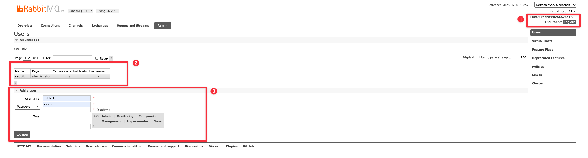
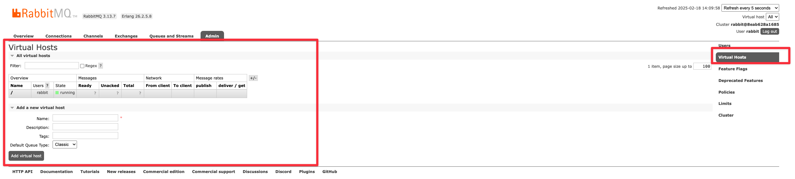

<!--more-->

## 什么是 MQ

MQ（Message Queue，消息队列）是一种用于在分布式系统中传递消息的通信机制。它允许应用程序通过发送和接收消息来进行异步通信，常用于解耦系统组件、提高可扩展性和可靠性。

## 为什么使用 MQ

- 解耦
- 异步
- 削峰

## AMQP 和 JMS

AMQP（高级消息队列协议）和 JMS（Java 消息服务）是两种常见的消息传递协议和 API，用于分布式系统中的消息通信。

### AMQP（Advanced Message Queuing Protocol）

- **定义**：AMQP 是一个开放标准的应用层协议，用于消息中间件，支持跨平台和跨语言的消息传递。
- **特点**：
  - **跨平台**：支持多种编程语言和操作系统。
  - **互操作性**：不同厂商的实现可以互相通信。
  - **灵活性**：支持多种消息模式，如点对点、发布/订阅。
  - **可靠性**：提供消息确认、持久化等机制，确保消息可靠传递。
- **应用场景**：适用于需要跨平台、跨语言的高可靠性和互操作性的场景。

### JMS（Java Message Service）

- **定义**：JMS 是 Java 平台上的 API，用于消息中间件，提供消息创建、发送、接收和读取的功能。
- **特点**：
  - **Java 专属**：主要用于 Java 应用程序。
  - **标准化**：定义了通用的接口和语义，具体实现由不同厂商提供。
  - **消息模式**：支持点对点（Queue）和发布/订阅（Topic）两种模式。
  - **事务支持**：支持事务性消息传递。
- **应用场景**：适用于 Java 应用程序，尤其是需要标准化消息传递接口的场景。

### 主要区别

- **语言支持**：AMQP 是多语言的，JMS 是 Java 专属。
- **协议 vs API**：AMQP 是协议，JMS 是 API。
- **互操作性**：AMQP 强调不同实现的互操作性，JMS 则依赖于具体实现。

### 总结

- **AMQP**：适合需要跨平台、跨语言的高可靠性和互操作性的场景。
- **JMS**：适合 Java 应用程序，尤其是需要标准化消息传递接口的场景。

RabbitMQ 是基于 AMQP 协议开发的。

## 相关概念

### Message

消息。消息是不具名的，它由消息头消息体组成。

消息体是不透明的，而消息头则由一系列可选属性组成，这些属性包括：

- routing-key(路由键)、
- priority(相对于其他消息的优先权)、
- delivery-mode(指出消息可能持久性存储)
- 等

### Publisher(P)

消息的生产者。

也是一个向交换器发布消息的客户端应用程序。

### Consumer(C)

消息的消费者。

表示一个从消息队列中取得消息的客户端应用程序。

### Exchange(X)

交换器。用来接收生产者发送的消息并将这些消息路由给服务器中的队列。

三种常用的交换器类型

- direct(发布与订阅 完全匹配)
- fanout(广播)
- topic(主题，规则匹配)

命名：小写字母，使用下划线 `_` 分隔不同的单词，避免使用连字符 `-`

`([direct|fanout|topic]_exchange_(biz_name))` 如 `direct_exchange_payment`

### Binding

绑定。

用于消息队列和交换器之间的关联。

一个绑定就是基于路由键将交换器和消息队列连接起来的路由规则，所以可以将交换器理解成一个由绑定构成的路由表。

### Queue(Q)

消息队列。用来保存消息直到发送给消费者。

它是消息的容器，也是消息的终点。一个消息可投入一个或多个队列。消息一直在队列里面，等待消费者链接到这个队列将其取走。

命名：小写字母，使用下划线 `_` 分隔不同的单词，应该包括描述其用途的关键字

`queue_(biz_name)` 如 `queue_payment`

### Routing-key

路由键。RabbitMQ 决定消息该投递到哪个队列的规则。

队列通过路由键绑定到交换器。

消息发送到 MQ 服务器时，消息将拥有一个路由键，即便是空的，RabbitMQ 也会将其和绑定使用的路由键进行匹配。

- 如果相匹配，消息将会投递到该队列。
- 如果不匹配，消息将会进入黑洞。

命名：小写字母，使用点号 `.` 分隔不同的路由关键字，路由键结构可以反映消息类型、来源、目的地等

`route.(biz_name).(adv.)` 如 `route.payment.success`

### Connection

链接。

指 rabbit 服务器和服务建立的 TCP 链接。

### Channel

信道。

- Channel 中文叫做信道，是 TCP 里面的虚拟链接。例如：电缆相当于 TCP，信道是一个独立光纤束，一条 TCP 连接上创建多条信道是没有问题的。
- TCP 一旦打开，就会创建 AMQP 信道。
- 无论是发布消息、接收消息、订阅队列，这些动作都是通过信道完成的。

### Virtual Host

虚拟主机。表示一批交换器，消息队列和相关对象。

虚拟主机是共享相同的身份认证和加密环境的独立服务器域。每个 vhost 本质上就是一个 mini 版的 RabbitMQ 服务器，拥有自己的队列、交换器、绑定和权限机制。vhost 是 AMQP 概念的基础，必须在链接时指定，RabbitMQ 默认的 vhost 是 `/`

命名：小写字母，使用短划线 `-` 或下划线 `_` 分隔不同的部分

如：`/dev` `/production` `/test`

### Broker

表示消息队列服务器实体。

### 交换器和队列的关系

交换器是通过路由键和队列绑定在一起的，如果消息拥有的路由键跟队列和交换器的路由键匹配，那么消息就会被路由到该绑定的队列中。

也就是说，消息到队列的过程中，消息首先会经过交换器，接下来交换器在通过路由键匹配分发消息到具体的队列中。路由键可以理解为匹配的规则。

### RabbitMQ 为什么需要信道，为什么不是 TCP 直接通信

1. TCP 的创建和销毁开销特别大。创建需要 3 次握手，销毁需要 4 次分手。
2. 如果不用信道，那应用程序就会以 TCP 链接 Rabbit，高峰时每秒成千上万条链接会造成资源巨大的浪费，而且操作系统每秒处理 TCP 链接数也是有限制的，必定造成性能瓶颈。
3. 信道的原理是一条线程一条通道，多条线程多条通道同用一条 TCP 链接。一条 TCP 链接可以容纳无限的信道，即使每秒成千上万的请求也不会成为性能的瓶颈。

## 权限(Admin)

### User 用户权限



总的有三个部分，分开描述

#### P1 (当前登录角色)

#### P2 (当前已存在角色)

- Name: 登录名
- Tags: 权限
- Can Access Virtual hosts: 可以访问的 host
- Has Password: 是否有密码

#### P3 (新增角色)

- Username: 用户名
- Password: 密码，可以下拉选择 [No Password], 不推荐
- Tags: 权限标签

其中用户标签（tags）用于定义用户的权限和角色。不同的标签赋予用户不同的操作权限。

1. **Admin**（完全控制）
   - **权限**: 允许用户执行所有管理操作。
   - **功能**: 管理用户、虚拟主机、权限、策略等，拥有最高权限。
2. **Monitoring**（查看监控信息）
   - **权限**: 允许用户查看 RabbitMQ 的状态和监控信息。
   - **功能**: 查看节点、连接、通道、队列等的状态，但不能修改配置或管理用户。
3. **Policymaker**（管理策略）
   - **权限**: 允许用户创建和管理策略（policies）。
   - **功能**: 定义队列和交换机的行为规则，如镜像队列、TTL 等，但不能管理用户或虚拟主机。
4. **Management**（访问管理界面）
   - **权限**: 允许用户访问和管理 RabbitMQ 的管理插件（Web UI 和 HTTP API）。
   - **功能**: 查看和管理队列、交换机、绑定、用户等，但不能修改配置或执行管理员操作。
5. **Impersonator**（模拟其他用户）
   - **权限**: 允许用户模拟其他用户进行操作。
   - **功能**: 主要用于调试和测试，模拟其他用户的权限执行操作。
6. **None**（仅基本操作）
   - **权限**: 无特殊权限。
   - **功能**: 用户只能执行基本的消息生产和消费操作，不能进行管理或监控。

### Virtual Hosts



#### 什么是 virtual host

可以类比数据库中的库，彼此之间做业务隔离。

新增参数：

- Name: 名称
- Description: 描述信息
- Tags: 分类，如 `env:production`, `env:dev`, `team:frontend`, `team:backend`
- Default Queue Type: 默认队列类型 (TODO: 解释不通队列的区别)
  - Classic
  - Quorum
  - Stream

#### 如何分配 Virtual Hosts

在上一小节的 User P2 部分，点击 Name 列即可进入人员信息编辑页面，在详情页面编辑即可。

## 消息类型

### Hello Word

最简单的模型：

```txt
P -> Q -> C
```

### Worker queues

```txt
         | -> C1
P -> Q ->| -> C2
         | -> C3
```

Worker queues 模型只有一个工作队列，是一种**竞争**消费模式。

同一个消息队列中绑定了多个消费者，多个消费者争抢着消费消息，**可以有效的避免消息堆积问题**。

### Publish/Subscribe

```txt
         | -> Q1 -> C1
P -> X ->|
         | -> Q2 -> C2
```

发送消息的时候没有指明 routing key 或者是指明了，但是所有消费者都知道，大家都能收到消息，就像广播一样。

### Routing

```txt
                      | - error -------> Q1 -> C1
                      |
P -> X(type=direct) ->| - info ---> |
                      | - error --> | -> Q2 -> C2
                      | - warning ->|
```

exchange 接收到生产者消息后，将消息交给 routing key 完全匹配的消息队列，消费者根据指定的 routing key 来消费消息。

### Topic

```txt
                      | - *.orange.* --- --> Q1 -> C1
                      |
P -> X(type=topic)  ->| - *.*.rabbit -> |
                      | - lazy.# -----> | -> Q2 -> C2
```

类似于上方的 Routing，区别是 Topic 的 routing key 支持通配符。

### RPC

本质是服务调用了，不作为服务消息模型进行过多介绍了。

### SpringBoot 如何使用

配置类：

```java
import org.springframework.amqp.core.Binding;
import org.springframework.amqp.core.BindingBuilder;
import org.springframework.amqp.core.CustomExchange;
import org.springframework.amqp.core.DirectExchange;
import org.springframework.amqp.core.FanoutExchange;
import org.springframework.amqp.core.HeadersExchange;
import org.springframework.amqp.core.Queue;
import org.springframework.amqp.core.TopicExchange;
import org.springframework.context.annotation.Bean;
import org.springframework.context.annotation.Configuration;

@Configuration
public class RabbitMQConfiguration {

    // 定义常量并报漏，方便后续 P 和 C 使用
    // Exchange
    public static final String DIRECT_EXCHANGE_BIZ = "direct_exchange_biz";
    public static final String FANOUT_EXCHANGE_BIZ = "fanout_exchange_biz";
    public static final String TOPIC_EXCHANGE_BIZ = "topic_exchange_biz";
    public static final String HEADERS_EXCHANGE_BIZ = "headers_exchange_biz";
    public static final String CUSTOM_EXCHANGE_BIZ = "custom_exchange_biz";
    // Queue
    public static final String QUEUE_BIZ_ALL = "queue_biz_all";
    public static final String QUEUE_BIZ_SUCCESS = "queue_biz_success";
    public static final String QUEUE_BIZ_FAILURE = "queue_biz_failure";
    // Topic
    public static final String ROUTE_BIZ_ALL = "route.biz.*";
    public static final String ROUTE_BIZ_SUCCESS = "route.biz.success";
    public static final String ROUTE_BIZ_FAILURE = "route.biz.failure";

    // Exchange =================>
    @Bean
    public DirectExchange directExchange() {
        return ExchangeBuilder.directExchange(DIRECT_EXCHANGE_BIZ).build();
    }

    @Bean
    public FanoutExchange fanoutExchange() {
        return ExchangeBuilder.fanoutExchange(FANOUT_EXCHANGE_BIZ).build();
    }

    @Bean
    public TopicExchange topicExchange() {
        return ExchangeBuilder.topicExchange(TOPIC_EXCHANGE_BIZ).build();
    }

    /**
     * 是基于消息头部（headers）进行路由的交换机。
     * 假设你有多个消费者处理不同类型的消息，
     * 你可以通过给每个消息添加不同的头信息（比如 messageType），
     * 然后根据 messageType 来决定消息投递给哪个队列
     */
    @Bean
    public HeadersExchange headersExchange() {
        return ExchangeBuilder.headersExchange(HEADERS_EXCHANGE_BIZ).build();
    }

    /**
     * 定义类型的交换机。
     * 如果你想要实现一个根据自定义规则处理消息的交换机，
     * 或者你希望实现不同的路由算法，
     * 可以创建一个 CustomExchange，
     * 让它具备自己特定的处理逻辑
     */
    @Bean
    public CustomExchange customExchange() {
        return new CustomExchange(CUSTOM_EXCHANGE_BIZ, "x-custom-type");
    }

    // Queue =================>
    @Bean
    public Queue bizAll() {
        return QueueBuilder.nonDurable(QUEUE_BIZ_ALL).build();
    }

    @Bean
    public Queue bizSuccess() {
        return QueueBuilder.nonDurable(QUEUE_BIZ_SUCCESS).build();
    }

    @Bean
    public Queue bizFailure() {
        return QueueBuilder.nonDurable(QUEUE_BIZ_FAILURE).build();
    }

    // Binding =================>
    // 使用路由规则，将 Q 绑定到 X
    // BindingBuilder.bind(bizAll).to(topicExchange).with(ROUTE_BIZ_ALL)
    // bind: 必须，绑定的是那个消息队列
    // to: 可选，默认情况下会是 AMQP_DEFAULT_EXCHANGE, 但在大多数情况下需要显式地定义交换机
    // with: 可选，只有在需要进行路由（如 direct 或 topic 类型的交换机）时才是必需的，
    // 对于 fanout 类型的交换机，路由键是不需要的

    @Bean
    public Binding bindingBizAllToTopicExchange(TopicExchange topicExchange, Queue bizAll) {
        return BindingBuilder.bind(bizAll).to(topicExchange).with(ROUTE_BIZ_ALL);
    }

    @Bean
    public Binding bindingBizSuccessToTopicExchange(TopicExchange topicExchange, Queue bizSuccess) {
        return BindingBuilder.bind(bizSuccess).to(topicExchange).with(ROUTE_BIZ_SUCCESS);
    }

    @Bean
    public Binding bindingBizFailureToTopicExchange(TopicExchange topicExchange, Queue bizFailure) {
        return BindingBuilder.bind(bizFailure).to(topicExchange).with(ROUTE_BIZ_SUCCESS);
    }
}

```

---

消费者类：

```java
import lombok.extern.slf4j.Slf4j;
import org.springframework.amqp.rabbit.annotation.RabbitHandler;
import org.springframework.amqp.rabbit.annotation.RabbitListener;
import org.springframework.stereotype.Component;

@Slf4j
@Component
// 指定需要消费的 Queue 即可
@RabbitListener(queues = RabbitMQConfiguration.QUEUE_BIZ_ALL)
public class RabbitConsumer {

    @RabbitHandler
    public void receive(String message) {
        log.info("receive message: {}", message);
    }
}

```

---

生产者类：

```java
import com.lcsk42.mqrabbit.publisher.config.RabbitMQConfiguration;
import lombok.RequiredArgsConstructor;
import org.springframework.amqp.rabbit.connection.CorrelationData;
import org.springframework.amqp.rabbit.core.RabbitTemplate;
import org.springframework.stereotype.Component;

import java.util.UUID;

@Component
@RequiredArgsConstructor
public class RabbitProducer {
    private final RabbitTemplate rabbitTemplate;

    public void send(Object object) {
        rabbitTemplate.convertAndSend(
                // exchange: 如果你使用的是非默认交换机（如 Fanout、Direct 或 Topic），就需要指定交换机名称
                RabbitMQConfiguration.TOPIC_EXCHANGE_BIZ,
                // routingKey: 如果你使用的是 Direct 或 Topic 类型的交换机，
                // 你就需要根据交换机的配置和消息路由规则来指定 routingKey，
                // 以确保消息被正确路由到对应的队列
                RabbitMQConfiguration.ROUTE_BIZ_SUCCESS,
                // 消息对象
                object,
                // 唯一标识
                new CorrelationData(UUID.randomUUID().toString())
        );
    }
}

```

## 可靠投递(消息丢失)

```txt
P -> MQ -> C
```

整个过程中三个节点都有可能丢失消息。针对三种情况，给出以下不同的解决方案。

### P (生产者) 丢失消息的解决方法

- 发送数据前开启 RabbitMQ 的事务（由于事务机制，会导致吞吐量下降，严重消耗性能，不推荐）
- 开启 `confirm` 模式（异步，推荐）

事务机制是同步的，提交之后会阻塞， confirm 机制是异步的，发送消息之后可以继续发送另一个消息， RabbitMQ 接收到消息之后会异步调用 confirm 接口通知消息收到。

如何开启 confirm 模式：

配置文件需要增加配置项：

```yml
spring:
  publisher-confirm-type: correlated
  publisher-returns: true
```

---

消息生产者需要实现响应接口：

```java
import jakarta.annotation.PostConstruct;
import lombok.RequiredArgsConstructor;
import lombok.extern.slf4j.Slf4j;
import org.springframework.amqp.core.ReturnedMessage;
import org.springframework.amqp.rabbit.connection.CorrelationData;
import org.springframework.amqp.rabbit.core.RabbitTemplate;
import org.springframework.stereotype.Component;

import java.util.UUID;

@Slf4j
@Component
@RequiredArgsConstructor
public class AckPublisher implements RabbitTemplate.ConfirmCallback, RabbitTemplate.ReturnsCallback {

    private final RabbitTemplate rabbitTemplate;

    @PostConstruct
    public void init() {
        rabbitTemplate.setConfirmCallback(this);
        rabbitTemplate.setReturnsCallback(this);
    }

    /**
     * ConfirmCallback 机制用于确认消息是否到达 exchange
     *
     * @param correlationData 唯一标识
     * @param ack             确认结果
     * @param cause           失败原因
     */
    @Override
    public void confirm(CorrelationData correlationData, boolean ack, String cause) {
        // TODO: 消息入库或者警告提醒
        log.error("ConfirmCallback => CorrelationData: {}, ack: {}, cause: {}",
                correlationData,
                ack,
                cause);
    }

    /**
     * ReturnsCallback 机制用于处理一个不可路由的消息
     *
     * @param returnedMessage 不可路由的消息
     */
    @Override
    public void returnedMessage(ReturnedMessage returnedMessage) {
        // TODO: 消息入库或者警告提醒
        log.error("ReturnsCallback => ReturnedMessage: {}", returnedMessage);
    }

    public void sendMessageToExchangeFail(String msg) {
        // 发送一个消息，发送到不存在的 exchange
        rabbitTemplate.convertAndSend(
                // 不存在的 exchange
                "exchange_unknown",
                // 存在的 route
                "route",
                msg,
                // 唯一标识
                new CorrelationData(UUID.randomUUID().toString())
        );
        // 未到 exchange 确认
        //: ConfirmCallback =>
        // CorrelationData: CorrelationData [id=82891c14-0691-4008-8425-4e4d27db3229],
        // ack: false,
        // cause: channel error;
        //
        // protocol method: #method<channel.close>(
        //   reply-code=404,
        //   reply-text=NOT_FOUND - no exchange 'exchange_unknown' in vhost '/',
        //   class-id=60,
        //   method-id=40
        // )
    }

    public void sendMessageToQueueFail(String msg) {
        // 发送一个消息，发送到不存在的 queue
        rabbitTemplate.convertAndSend(
                // 存在的 exchange
                "exchange",
                // 不存在的 route
                "route_unknown",
                msg,
                // 唯一标识
                new CorrelationData(UUID.randomUUID().toString())
        );
        // exchange 确认了，但是找不到合适的路由
        //: ReturnsCallback => ReturnedMessage: ReturnedMessage [
        // message=(
        //   Body:'ack-queue'
        //   MessageProperties [
        //     headers={spring_returned_message_correlation=c90946d5-02be-4a29-b60d -22a151436125},
        //     contentType=text/plain,
        //     contentEncoding=UTF-8,
        //     contentLength=0,
        //     receivedDeliveryMode=PERSISTENT,
        //     priority=0,
        //     deliveryTag=0
        //   ]
        // ),
        // replyCode=312,
        // replyText=NO_ROUTE,
        // exchange=exchange,
        // routingKey=route_unknown
        // ]
        //
        //: ConfirmCallback =>
        // CorrelationData: CorrelationData [id=c90946d5-02be-4a29-b60d-22a151436125],
        // ack: true,
        // cause: null
    }
}

```

### MQ (消息队列) 丢失消息的解决方案

1. 创建 `exchange` 时候设置为持久化，`exchange` 和 `queue` 都是持久化的，那么它们之间的 `binding` 也是持久化的，只有两个都持久化了，才允许建立绑定。
2. 创建 `queue` 时设置为持久化，这样可以保证 RabbitMQ 持久化 `queue` 的元数据，但是并不会持久化 `queue` 中的数据
3. 发送消息时将消息的 `deliveryMode` 设置为持久化，此时 `queue` 中的消息才会持久化到磁盘

同时设置了 `queue` 和 `message` 的持久化后，RabbitMQ 挂掉再重启后，会从磁盘恢复 `queue`，确保数据不会丢失。

```java
    // 持久化 Exchange
    @Bean
    public FanoutExchange durableExchange() {
        // durable: 是否持久化
        // autoDelete: 自动删除，如果该队列没有任何订阅的消费者的话，该队列会被自动删除。这种队列适用于临时队列
        return ExchangeBuilder.fanoutExchange("durable_exchange_biz").durable(true).build();
    }

    // 持久化 Queue
    @Bean
    public Queue durableQueue() {
        // durable: 是否持久化
        return QueueBuilder.durable("queue_biz_durable").build();
    }

    // 绑定
    @Bean
    public Binding bindingDurableQueueToDurableExchange(FanoutExchange durableExchange, Queue durableQueue) {
        return BindingBuilder.bind(durableQueue).to(durableExchange);
    }

    // convertAndSend 不需要做操作，默认就是持久化的
    // MessageProperties.deliveryMode = MessageDeliveryMode.PERSISTENT

```

### C (消费者) 丢失消息的解决方案

关闭自动 ACK, 使用手动 ACK。

默认情况下消费者收到消息，RabbitMQ 会自动提交 ACK，之后这条消息就不会发送给消费者了。

修改为手动 ACK，每次处理完消息，再手动 ACK 一下。这样可能会导致没有手动 ACK，消费者挂了，导致消息被重复消费，不过这种情况下做好幂等就可以了，重复消费也不会造成问题。

```java
import com.rabbitmq.client.Channel;
import lombok.extern.slf4j.Slf4j;
import org.springframework.amqp.rabbit.annotation.RabbitHandler;
import org.springframework.amqp.rabbit.annotation.RabbitListener;
import org.springframework.amqp.support.AmqpHeaders;
import org.springframework.messaging.handler.annotation.Header;
import org.springframework.stereotype.Component;

import java.io.IOException;
import java.time.LocalDateTime;
import java.util.concurrent.TimeUnit;

@Slf4j
@Component
@RabbitListener(queues = RabbitConfiguration.DEFAULT_QUEUE)
public class AckConsumer {
    @RabbitHandler
    public void receive(String message,
                        Channel channel,
                        @Header(AmqpHeaders.DELIVERY_TAG) long deliveryTag) {
        try {
            log.info("MessageConsumer receive message: {}", message);
            log.info("MessageConsumer receive deliveryTag: {}", deliveryTag);
            TimeUnit.SECONDS.sleep(5);
            channel.basicAck(deliveryTag, false);
            log.info("Ack Success: {}", LocalDateTime.now());
        } catch (IOException | InterruptedException exception) {
            log.error("Ack Failure: {}", message);
        }
    }
}

```

## 消费幂等

利用 SpEL 生成指纹，实现消费方业务接口幂等。

// TODO

## 消息顺序

## 消息积压

在大型分布式项目中，如果消费者挂了，无法消费消息，或者消费的速度赶不上生产的速度，此时就有可能出现 MQ 中挤压大量、千万级消息。

场景：消费端服务出故障，大量消息积压在 mq 中

解决方案：

1. 修复 consumer 问题，停掉当前的 consumer，重新部署修复后的 consumer，并增加数量，提升消费能力
2. 新增专门的队列，将消息批量取出并持久化，等待过了高峰期，重新导出数据

## 死信队列

如果在消费消息时，如果消息出现以下几种情况：

1. 消息被否定确认，使用 `channel.basicNack` 或 `channel.basicReject`，并且此时`requeue` 属性被设置为 `false`。
2. 消息在队列的存活时间超过设置的 TTL 时间。
3. 消息队列的消息数量已经超过最大队列长度。

那么本条消息就变成了 "死信"。

- 如果配置了死信队列，那么消息会被放入死信队列中
- 如果没有配置死信队列，那么消息将会被丢弃

### 如何配置死信队列

1. 配置业务队列，绑定到业务交换机上
2. 为业务队列配置死信交换剂和路由
3. 为死信交换机配置死信队列

依赖文件：

本次使用版本为 3.0.7

- spring-boot-starter-amqp: 3.0.7
- spring-boot-starter-web: 3.0.7

```xml
<dependencies>
    <dependency>
        <groupId>org.springframework.boot</groupId>
        <artifactId>spring-boot-starter-amqp</artifactId>
    </dependency>

    <dependency>
        <groupId>org.springframework.boot</groupId>
        <artifactId>spring-boot-starter-web</artifactId>
    </dependency>
</dependencies>
```

配置文件：

```yml
spring:
  listener:
    simple:
      acknowledge-mode: manual
      default-requeue-rejected: false
    type: simple
```

---

配置类：

```java
import org.springframework.amqp.core.Binding;
import org.springframework.amqp.core.BindingBuilder;
import org.springframework.amqp.core.DirectExchange;
import org.springframework.amqp.core.ExchangeBuilder;
import org.springframework.amqp.core.FanoutExchange;
import org.springframework.amqp.core.Queue;
import org.springframework.amqp.core.QueueBuilder;
import org.springframework.context.annotation.Bean;
import org.springframework.context.annotation.Configuration;

@Configuration
public class RabbitMQDeadLetterConfiguration {

    // exchange
    public static final String FANOUT_EXCHANGE_BIZ = "fanout_exchange_biz";
    public static final String DIRECT_EXCHANGE_DEAD_LETTER = "direct_exchange_dead-letter";
    // queue
    public static final String QUEUE_BIZ_A = "queue_biz_a";
    public static final String QUEUE_BIZ_B = "queue_biz_b";
    public static final String QUEUE_DEAD_LETTER_A = "queue_dead-letter_a";
    public static final String QUEUE_DEAD_LETTER_B = "queue_dead-letter_b";
    // topic
    public static final String ROUTING_KEY_DEAD_LETTER_A = "routing-key.dead-letter.a";
    public static final String ROUTING_KEY_DEAD_LETTER_B = "routing-key.dead-letter.b";


    /**
     * 业务 Exchange
     */
    @Bean
    public FanoutExchange bizFanoutExchange() {
        return ExchangeBuilder.fanoutExchange(FANOUT_EXCHANGE_BIZ).build();
    }

    /**
     * 死信 Exchange （可以是任意类型[direct|topic|fanout]）
     */
    @Bean
    public DirectExchange deadLetterDirectExchange() {
        return ExchangeBuilder.directExchange(DIRECT_EXCHANGE_DEAD_LETTER).build();
    }

    /**
     * 业务队列 A
     */
    @Bean
    public Queue bizAQueue() {
        return QueueBuilder
                .durable(QUEUE_BIZ_A)
                .deadLetterExchange(DIRECT_EXCHANGE_DEAD_LETTER)
                // 这里如果进行了配置，消息编程死信后，路由 key 会编程配置的值
                // 如果没有进行配置，消息变成死信后，路由原来的 key 会被保留
                .deadLetterRoutingKey(ROUTING_KEY_DEAD_LETTER_A)
                .build();
    }

    /**
     * 业务队列 B
     */
    @Bean
    public Queue bizBQueue() {
        return QueueBuilder
                .durable(QUEUE_BIZ_B)
                .deadLetterExchange(DIRECT_EXCHANGE_DEAD_LETTER)
                .deadLetterRoutingKey(ROUTING_KEY_DEAD_LETTER_B)
                .build();
    }

    /**
     * 死信队列 A
     */
    @Bean
    public Queue deadLetterAQueue() {
        return QueueBuilder.nonDurable(QUEUE_DEAD_LETTER_A).build();
    }

    /**
     * 死信队列 B
     */
    @Bean
    public Queue deadLetterBQueue() {
        return QueueBuilder.nonDurable(QUEUE_DEAD_LETTER_B).build();
    }

    /**
     * bing bizFanoutExchange -> bizAQueue
     */
    @Bean
    public Binding bindingBizAQueueToBizDirectExchange(Queue bizAQueue,
                                                       FanoutExchange bizFanoutExchange) {
        return BindingBuilder.bind(bizAQueue).to(bizFanoutExchange);
    }

    /**
     * bing bizFanoutExchange -> bizBQueue
     */
    @Bean
    public Binding bindingBizBQueueToBizDirectExchange(Queue bizBQueue,
                                                       FanoutExchange bizFanoutExchange) {
        return BindingBuilder.bind(bizBQueue).to(bizFanoutExchange);
    }

    /**
     * bing deadLetterDirectExchange -> deadLetterAQueue
     */
    @Bean
    public Binding bindingDeadLetterAQueueToDeadLetterDirectExchange(Queue deadLetterAQueue,
                                                                     DirectExchange deadLetterDirectExchange) {
        return BindingBuilder.bind(deadLetterAQueue).to(deadLetterDirectExchange).with(ROUTING_KEY_DEAD_LETTER_A);
    }

    /**
     * bing deadLetterDirectExchange -> deadLetterBQueue
     */
    @Bean
    public Binding bindingDeadLetterBQueueToDeadLetterDirectExchange(Queue deadLetterBQueue,
                                                                     DirectExchange deadLetterDirectExchange) {
        return BindingBuilder.bind(deadLetterBQueue).to(deadLetterDirectExchange).with(ROUTING_KEY_DEAD_LETTER_B);
    }
}

```

---

业务消费者：

```java
import com.rabbitmq.client.Channel;
import lombok.extern.slf4j.Slf4j;
import org.springframework.amqp.core.Message;
import org.springframework.amqp.rabbit.annotation.RabbitListener;
import org.springframework.stereotype.Component;

import java.io.IOException;

@Slf4j
@Component
public class BizReceiver {

    @RabbitListener(queues = RabbitMQDeadLetterConfiguration.QUEUE_BIZ_A)
    public void receiveA(Message message, Channel channel) throws IOException {
        String msg = new String(message.getBody());
        log.info("BizReceiver#receiveA: {}", msg);

        boolean ack = true;
        Exception exception = null;
        try {
            if (msg.contains("dead-letter")) {
                throw new RuntimeException("DeadLetterException");
            }
        } catch (Exception e) {
            ack = false;
            exception = e;
        }

        long deliveryTag = message.getMessageProperties().getDeliveryTag();

        if (ack) {
            channel.basicAck(deliveryTag, false);
        } else {
            log.error("BizReceiver#receiveA:error: {} ", exception.getMessage(), exception);
            channel.basicNack(deliveryTag, false, false);
        }
    }

    @RabbitListener(queues = RabbitMQDeadLetterConfiguration.QUEUE_BIZ_B)
    public void receiveB(Message message, Channel channel) throws IOException {
        String msg = new String(message.getBody());
        log.info("BizReceiver#receiveB: {}", msg);
        long deliveryTag = message.getMessageProperties().getDeliveryTag();
        channel.basicAck(deliveryTag, false);
    }
}

```

---

死信消费者：

```java
import com.rabbitmq.client.Channel;
import lombok.extern.slf4j.Slf4j;
import org.springframework.amqp.core.Message;
import org.springframework.amqp.rabbit.annotation.RabbitListener;
import org.springframework.stereotype.Component;

import java.io.IOException;

@Slf4j
@Component
public class DeadLetterReceiver {

    @RabbitListener(queues = RabbitMQDeadLetterConfiguration.QUEUE_DEAD_LETTER_A)
    public void receiveA(Message message, Channel channel) throws IOException {
        String msg = new String(message.getBody());
        log.info("DeadLetterReceiver#receiveA: {}", msg);
        long deliveryTag = message.getMessageProperties().getDeliveryTag();
        channel.basicAck(deliveryTag, false);
    }

    @RabbitListener(queues = RabbitMQDeadLetterConfiguration.QUEUE_DEAD_LETTER_B)
    public void receiveB(Message message, Channel channel) throws IOException {
        String msg = new String(message.getBody());
        log.info("DeadLetterReceiver#receiveB: {}", msg);
        long deliveryTag = message.getMessageProperties().getDeliveryTag();
        channel.basicAck(deliveryTag, false);
    }
}

```

---

业务生产者：

```java
import lombok.RequiredArgsConstructor;
import org.springframework.amqp.rabbit.core.RabbitTemplate;
import org.springframework.stereotype.Component;

@Component
@RequiredArgsConstructor
public class BizProducer {
    private final RabbitTemplate rabbitTemplate;

    public void send(String msg) {
        rabbitTemplate.convertSendAndReceive(
                RabbitMQDeadLetterConfiguration.FANOUT_EXCHANGE_BIZ,
                "",
                msg);
    }
}

```

---

为方便测试，增加 controller:

```java
import lombok.RequiredArgsConstructor;
import org.springframework.web.bind.annotation.GetMapping;
import org.springframework.web.bind.annotation.PathVariable;
import org.springframework.web.bind.annotation.RequestMapping;
import org.springframework.web.bind.annotation.RestController;

@RestController
@RequestMapping("/biz")
@RequiredArgsConstructor
public class DeadLetterController {
    private final BizProducer bizProducer;

    @GetMapping("/msg/{message}")
    public void send(@PathVariable String message) {
        bizProducer.send(message);
    }
}
```

---

测试结果：

```txt
http://localhost:8080/biz/msg/biz-message

: BizReceiver#receiveA: biz-message
: BizReceiver#receiveB: biz-message
```

---

```txt
http://localhost:8080/biz/msg/dead-letter-message

: BizReceiver#receiveB: dead-letter-message
: BizReceiver#receiveA: dead-letter-message
: BizReceiver#receiveA:error: DeadLetterException
...
: DeadLetterReceiver#receiveA: dead-letter-message
```

可以看到，所有流程已经打通，bizA 消费失败后，消息到了死信交换机并转发，最终由 deadLetterA 消费。

### 声明周期

1. 业务消息正常投递到业务队列中
2. 消费者消费业务队列的消息，处理过程中发生了异常，于是进行了 `nack` 或者 `reject` 操作
3. 被 `nack` 或者 `reject` 的消息由 RabbitMQ 投递到死信交换机中
4. 死信交换机将消息投入到对应的死信队列中
5. 死信队列的消费者消费死信消息

总结来说就是死信消息只是。RabbitMQ 为我们做的一层保障。但是其实如果我们不使用死信消息，在触发异常时，将消息主动投递到另一个交换机中，然后自己做后续的处理也可以。

### 死信队列应用场景

重要业务场景中，确保未被消费的消息不被丢弃。当发生异常时，不能每次都去找日志获取愿消息，然后再找运维重新投递。通过配置死信队列，可以让未正确处理的消息暂存到另一个队列中，待后续排查清楚问题后，编写对应的代码处理死信消息，会比手工恢复好太多。

## 延迟队列

延迟队列，顾名思义，首先他要是个队列，其次，他要能延时，从一端进入之后，过指定的时间，从另一端可以取出。

### 延迟队列应用场景

1. 订单十分钟未支付则自动取消
2. 新账号注册完成后三天内没有登录，发送短信提醒
3. 用户发起退款，三天内没有被解决，通知相关运营人员
4. 预定会议后，在预定时间前半个小时提醒各方人员参加会议

### RabbitMQ 中的 TTL

TTL (Time to Live) 表示**一条消息或者该队列中所有消息的最大存活时间**，单位是**毫秒**。

也就是说如果一条消息设置了 TTL 或者进入了设置 TTL 的队列，如果在这只的时间没有被消费，则会成为 "死信"。

如果同时设置了队列的 TTL 和消息的 TTL，则取较小的值。

设置的第一种方法，在创建队列的时候设置队列的 `x-message-ttl` 属性：

```java
    @Bean
    public Queue queue() {
        return QueueBuilder
                .durable()
                // x-message-ttl
                .ttl(6000)
                .build();
    }
```

设置的第二种方法是针对每条消息设置单独的 TTL，如:

```java
    rabbitTemplate.convertSendAndReceive(
            RabbitMQDeadLetterConfiguration.FANOUT_EXCHANGE_BIZ,
            "",
            message -> {
                message.getMessageProperties().setExpiration("6000");
                return message;
            });
    }
```

两种设置方法是有区别的：

- 设置了队列的 TTL，那么一旦消息过期，就会被队列丢弃
- 设置了消息的 TTL，即使消息过期，也不一定会被马上丢弃，因为消息是否过期是在即将投递到消费者前判断的，如果队列中有严重的消息积压情况，即使已经过期的消息也许也能存活很久的时间

### 如何使用 Rabbit 实现延时队列

延时队列，就是想要消息延时多久后被处理。

那么 TTL 可以让消息在延时指定时间后成为死信，另一方面成为死信的消息会被投递到死信的消息队列中，那么消费者消费死信中的消息，就是希望被立即处理的消息了。

```txt
P1 ->|             | -> Q1(延时) ->|             | -> Q1(死信) -> C1
     |-> X(延时) -> |              | -> X(死信) ->|
P2 ->|             | -> Q2(延时) ->|             | -> Q2(死信) -> C2
```

配置类：

```java
import org.springframework.amqp.core.Binding;
import org.springframework.amqp.core.BindingBuilder;
import org.springframework.amqp.core.DirectExchange;
import org.springframework.amqp.core.ExchangeBuilder;
import org.springframework.amqp.core.Queue;
import org.springframework.amqp.core.QueueBuilder;
import org.springframework.context.annotation.Bean;
import org.springframework.context.annotation.Configuration;

@Configuration
public class RabbitMQDelayedConfiguration {

    // exchange
    public static final String DIRECT_EXCHANGE_DELAY = "direct_exchange-delay";
    public static final String DIRECT_EXCHANGE_DEAD_LETTER =
            "direct_exchange_dead-letter";

    // queue
    public static final String QUEUE_DELAY_A = "queue_delay_a";
    public static final String QUEUE_DELAY_B = "queue_delay_b";
    public static final String QUEUE_DEAD_LETTER_A = "queue_dead-letter_a";
    public static final String QUEUE_DEAD_LETTER_B = "queue_dead-letter_b";

    // topic
    public static final String ROUTING_KEY_DELAY_A = "routing-key.delay.a";
    public static final String ROUTING_KEY_DELAY_B = "routing-key.delay.b";
    public static final String ROUTING_KEY_DEAD_LETTER_A = "routing-key.dead-letter.a";
    public static final String ROUTING_KEY_DEAD_LETTER_B = "routing-key.dead-letter.b";

    /**
     * 延迟 TTL 交换机
     */
    @Bean
    public DirectExchange delayDirectExchange() {
        return ExchangeBuilder.directExchange(DIRECT_EXCHANGE_DELAY).build();
    }

    /**
     * 死信交换机
     */
    @Bean
    public DirectExchange deadLetterExchange() {
        return ExchangeBuilder.directExchange(DIRECT_EXCHANGE_DEAD_LETTER).build();
    }

    /**
     * 延时队列A 1000
     */
    @Bean
    public Queue delayQueueA() {
        return QueueBuilder
                .durable(QUEUE_DELAY_A)
                .deadLetterExchange(DIRECT_EXCHANGE_DEAD_LETTER)
                .deadLetterRoutingKey(ROUTING_KEY_DEAD_LETTER_A)
                .ttl(10000)
                .build();
    }

    /**
     * 延时队列B 6000
     */
    @Bean
    public Queue delayQueueB() {
        return QueueBuilder
                .durable(QUEUE_DELAY_B)
                .deadLetterExchange(DIRECT_EXCHANGE_DEAD_LETTER)
                .deadLetterRoutingKey(ROUTING_KEY_DEAD_LETTER_B)
                .ttl(60000)
                .build();
    }

    /**
     * 死信队列A
     */
    @Bean
    public Queue deadLetterQueueA() {
        return QueueBuilder
                .durable(QUEUE_DEAD_LETTER_A)
                .build();
    }

    /**
     * 死信队列B
     */
    @Bean
    public Queue deadLetterQueueB() {
        return QueueBuilder
                .durable(QUEUE_DEAD_LETTER_B)
                .build();
    }


    // binding delayQueueA -> delayDirectExchange
    @Bean
    public Binding bindingDelayQueueAToDelayDirectExchange(Queue delayQueueA,
                                                           DirectExchange delayDirectExchange) {
        return BindingBuilder.bind(delayQueueA).to(delayDirectExchange).with(ROUTING_KEY_DELAY_A);
    }

    // binding delayQueueB -> delayDirectExchange
    @Bean
    public Binding bindingDelayQueueBToDelayDirectExchange(Queue delayQueueB,
                                                           DirectExchange delayDirectExchange) {
        return BindingBuilder.bind(delayQueueB).to(delayDirectExchange).with(ROUTING_KEY_DELAY_B);
    }


    // binding deadLetterQueueA -> deadLetterExchange
    @Bean
    public Binding bindingDeadLetterQueueAToDeadLetterExchange(Queue deadLetterQueueA,
                                                               DirectExchange deadLetterExchange) {
        return BindingBuilder.bind(deadLetterQueueA).to(deadLetterExchange).with(ROUTING_KEY_DEAD_LETTER_A);
    }

    // binding deadLetterQueueB -> deadLetterExchange
    @Bean
    public Binding bindingDeadLetterQueueBToDeadLetterExchange(Queue deadLetterQueueB,
                                                               DirectExchange deadLetterExchange) {
        return BindingBuilder.bind(deadLetterQueueB).to(deadLetterExchange).with(ROUTING_KEY_DEAD_LETTER_B);
    }
}

```

---

死信消费者：

```java
import com.rabbitmq.client.Channel;
import lombok.extern.slf4j.Slf4j;
import org.springframework.amqp.core.Message;
import org.springframework.amqp.rabbit.annotation.RabbitListener;
import org.springframework.stereotype.Component;

import java.io.IOException;
import java.time.LocalDateTime;

@Slf4j
@Component
public class DeadLetterReceiver {

    @RabbitListener(queues = RabbitMQDelayedConfiguration.QUEUE_DEAD_LETTER_A)
    public void receiveA(Message message, Channel channel) throws IOException {
        String msg = new String(message.getBody());
        String localDateTimeNow = LocalDateTime.now().toString();
        log.info("DeadLetterReceiver#receiveA: {} {}", localDateTimeNow, msg);
        long deliveryTag = message.getMessageProperties().getDeliveryTag();
        channel.basicAck(deliveryTag, false);
    }

    @RabbitListener(queues = RabbitMQDelayedConfiguration.QUEUE_DEAD_LETTER_B)
    public void receiveB(Message message, Channel channel) throws IOException {
        String msg = new String(message.getBody());
        String localDateTimeNow = LocalDateTime.now().toString();
        log.info("DeadLetterReceiver#receiveA: {} {}", localDateTimeNow, msg);
        long deliveryTag = message.getMessageProperties().getDeliveryTag();
        channel.basicAck(deliveryTag, false);
    }
}

```

延迟消息生产者：

```java
import lombok.RequiredArgsConstructor;
import org.springframework.amqp.rabbit.core.RabbitTemplate;
import org.springframework.stereotype.Component;

@Component
@RequiredArgsConstructor
public class DelayProducer {
    private final RabbitTemplate rabbitTemplate;

    public void sendDelay10000(String msg) {
        rabbitTemplate.convertSendAndReceive(
                RabbitMQDelayedConfiguration.DIRECT_EXCHANGE_DELAY,
                RabbitMQDelayedConfiguration.ROUTING_KEY_DELAY_A,
                msg);
    }

    public void sendDelay60000(String msg) {
        rabbitTemplate.convertSendAndReceive(
                RabbitMQDelayedConfiguration.DIRECT_EXCHANGE_DELAY,
                RabbitMQDelayedConfiguration.ROUTING_KEY_DELAY_B,
                msg);
    }
}

```

---

为了方便测试，增加 controller:

```java
import lombok.RequiredArgsConstructor;
import org.springframework.web.bind.annotation.GetMapping;
import org.springframework.web.bind.annotation.RequestMapping;
import org.springframework.web.bind.annotation.RestController;

import java.time.LocalDateTime;

@RestController
@RequestMapping("/delay")
@RequiredArgsConstructor
public class DelayController {
    private final DelayProducer delayProducer;

    @GetMapping("/10000")
    public void sendDelay10000() {
        delayProducer.sendDelay10000(LocalDateTime.now().toString());
    }

    @GetMapping("/60000")
    public void sendDelay60000() {
        delayProducer.sendDelay60000(LocalDateTime.now().toString());
    }
}
```

测试结果：

```txt
http://localhost:8080/delay/10000

: DeadLetterReceiver#receiveA: 2025-02-20T14:25:49.832087 2025-02-20T14:25:39.786720
```

---

```txt
http://localhost:8080/delay/60000

: DeadLetterReceiver#receiveA: 2025-02-20T14:27:08.159785 2025-02-20T14:26:08.139689
```

### 更进一步

上述为一个队列一个 延迟时间，如果延迟时间不同，就需要创建不同的队列，影响开发和运维，如果想要通用的话，就需要将 TTL 时间设置在消息属性中了。

配置类：

```java
import org.springframework.amqp.core.Binding;
import org.springframework.amqp.core.BindingBuilder;
import org.springframework.amqp.core.DirectExchange;
import org.springframework.amqp.core.ExchangeBuilder;
import org.springframework.amqp.core.Queue;
import org.springframework.amqp.core.QueueBuilder;
import org.springframework.context.annotation.Bean;
import org.springframework.context.annotation.Configuration;

@Configuration
public class RabbitMQDelayedConfiguration {

    // exchange
    public static final String DIRECT_EXCHANGE_DELAY = "direct_exchange-delay";
    public static final String DIRECT_EXCHANGE_DEAD_LETTER =
            "direct_exchange_dead-letter";

    // queue
    public static final String QUEUE_DELAY = "queue_delay";
    public static final String QUEUE_DEAD_LETTER = "queue_dead-letter";

    // topic
    public static final String ROUTING_KEY_DELAY = "routing-key.delay";
    public static final String ROUTING_KEY_DEAD_LETTER = "routing-key.dead-letter";

    /**
     * 延迟 TTL 交换机
     */
    @Bean
    public DirectExchange delayDirectExchange() {
        return ExchangeBuilder.directExchange(DIRECT_EXCHANGE_DELAY).build();
    }

    /**
     * 死信交换机
     */
    @Bean
    public DirectExchange deadLetterExchange() {
        return ExchangeBuilder.directExchange(DIRECT_EXCHANGE_DEAD_LETTER).build();
    }

    /**
     * 延时队列, 此时不设置队列中消息的过期时间
     */
    @Bean
    public Queue delayQueue() {
        return QueueBuilder
                .durable(QUEUE_DELAY)
                .deadLetterExchange(DIRECT_EXCHANGE_DEAD_LETTER)
                .deadLetterRoutingKey(ROUTING_KEY_DEAD_LETTER)
                .build();
    }

    /**
     * 死信队列
     */
    @Bean
    public Queue deadLetterQueue() {
        return QueueBuilder
                .durable(QUEUE_DEAD_LETTER)
                .build();
    }

    // binding delayQueue -> delayDirectExchange
    @Bean
    public Binding bindingDelayQueueAToDelayDirectExchange(Queue delayQueue,
                                                           DirectExchange delayDirectExchange) {
        return BindingBuilder.bind(delayQueue).to(delayDirectExchange).with(ROUTING_KEY_DELAY);
    }


    // binding deadLetterQueue -> deadLetterExchange
    @Bean
    public Binding bindingDeadLetterQueueAToDeadLetterExchange(Queue deadLetterQueue,
                                                               DirectExchange deadLetterExchange) {
        return BindingBuilder.bind(deadLetterQueue).to(deadLetterExchange).with(ROUTING_KEY_DEAD_LETTER);
    }
}

```

---

消费者：

```java
import com.rabbitmq.client.Channel;
import lombok.extern.slf4j.Slf4j;
import org.springframework.amqp.core.Message;
import org.springframework.amqp.rabbit.annotation.RabbitListener;
import org.springframework.stereotype.Component;

import java.io.IOException;
import java.time.LocalDateTime;

@Slf4j
@Component
public class DeadLetterReceiver {

    @RabbitListener(queues = RabbitMQDelayedConfiguration.QUEUE_DEAD_LETTER)
    public void receive(Message message, Channel channel) throws IOException {
        String msg = new String(message.getBody());
        String localDateTimeNow = LocalDateTime.now().toString();
        log.info("DeadLetterReceiver#receiveA: {} {}", localDateTimeNow, msg);
        long deliveryTag = message.getMessageProperties().getDeliveryTag();
        channel.basicAck(deliveryTag, false);
    }
}

```

---

生产者：

```java
import lombok.RequiredArgsConstructor;
import org.springframework.amqp.core.MessageBuilder;
import org.springframework.amqp.rabbit.core.RabbitTemplate;
import org.springframework.stereotype.Component;

import java.nio.charset.StandardCharsets;

@Component
@RequiredArgsConstructor
public class DelayProducer {
    private final RabbitTemplate rabbitTemplate;

    public void sendDelay(String msg, String expiration) {
        rabbitTemplate.convertAndSend(
                RabbitMQDelayedConfiguration.DIRECT_EXCHANGE_DELAY,
                RabbitMQDelayedConfiguration.ROUTING_KEY_DELAY,
                MessageBuilder.withBody(msg.getBytes(StandardCharsets.UTF_8))
                        // 设置过期时间
                        .setExpiration(expiration)
                        .build()
        );
    }
}

```

---

方便测试提供的 controller:

```java
import lombok.RequiredArgsConstructor;
import org.springframework.web.bind.annotation.GetMapping;
import org.springframework.web.bind.annotation.PathVariable;
import org.springframework.web.bind.annotation.RequestMapping;
import org.springframework.web.bind.annotation.RestController;

import java.time.LocalDateTime;

@RestController
@RequestMapping("/delay")
@RequiredArgsConstructor
public class DelayController {
    private final DelayProducer delayProducer;

    @GetMapping("/{expiration}")
    public void sendDelay(@PathVariable String expiration) {
        delayProducer.sendDelay(LocalDateTime.now().toString(), expiration);
    }
}
```

---

测试结果：

```txt
http://localhost:8080/delay/10000

: DeadLetterReceiver#receiveA: 2025-02-20T14:53:12.869353 2025-02-20T14:53:02.863495
```

此时看结果是正确的，但是如果同时有两个消息呢，一个消息为 20000 ,一个消息为 2000 延时：

```txt
http://localhost:8080/delay/20000
http://localhost:8080/delay/2000

: DeadLetterReceiver#receiveA: 2025-02-20T14:56:45.746856 2025-02-20T14:56:25.727166
: DeadLetterReceiver#receiveA: 2025-02-20T14:56:45.748068 2025-02-20T14:56:28.251651
```

可以看到，第一个请求的 20s 可以正确的被消费，但是第二个 2s 的却是一只等到第一个消息被消费后才能被消费，这个就是因为在 [RabbitMQ 中的 TTL](#rabbitmq-中的-ttl) 章节最后总结的。

### 解决问题（插件）

如上所述，如果不能在消息粒度添加 TTL，并在设置了 TTL 之后及时死亡，那么这种设计方案就不可用。

为了解决这个问题，需要安装一个插件 [rabbitmq-delayed-message-exchange](https://github.com/rabbitmq/rabbitmq-delayed-message-exchange/releases)

接下来使用插件来完成对应功能(跟上方使用死信队列没有关系了)：

配置文件：

```java
import org.springframework.amqp.core.Binding;
import org.springframework.amqp.core.BindingBuilder;
import org.springframework.amqp.core.CustomExchange;
import org.springframework.amqp.core.Queue;
import org.springframework.amqp.core.QueueBuilder;
import org.springframework.context.annotation.Bean;
import org.springframework.context.annotation.Configuration;

import java.util.Map;

@Configuration
public class RabbitMQDelayedConfiguration {

    // exchange
    public static final String CUSTOM_EXCHANGE_DELAY = "custom_exchange-delay";

    // queue
    public static final String QUEUE_DELAY = "queue_delay";

    // topic
    public static final String ROUTING_KEY_DELAY = "routing-key.delay";

    @Bean
    public CustomExchange delayCustomExchange() {
        return new CustomExchange(
                CUSTOM_EXCHANGE_DELAY,
                "x-delayed-message",
                true,
                false,
                Map.of("x-delayed-type", "direct")
        );
    }

    @Bean
    public Queue delayQueue() {
        return QueueBuilder.durable(QUEUE_DELAY).build();
    }

    /**
     * binding delayQueue -> delayCustomExchange
     */
    @Bean
    public Binding bindingDelayQueueToDelayCustomExchange(Queue delayQueue, CustomExchange delayCustomExchange) {
        return BindingBuilder.bind(delayQueue).to(delayCustomExchange).with(ROUTING_KEY_DELAY).noargs();
    }
}

```

消费者：

```java
import com.rabbitmq.client.Channel;
import lombok.extern.slf4j.Slf4j;
import org.springframework.amqp.core.Message;
import org.springframework.amqp.rabbit.annotation.RabbitListener;
import org.springframework.stereotype.Component;

import java.io.IOException;
import java.time.LocalDateTime;

@Slf4j
@Component
public class DelayReceiver {

    @RabbitListener(queues = RabbitMQDelayedConfiguration.QUEUE_DELAY)
    public void receive(Message message, Channel channel) throws IOException {
        String msg = new String(message.getBody());
        String localDateTimeNow = LocalDateTime.now().toString();
        log.info("DeadLetterReceiver#receiveA: {} {}", localDateTimeNow, msg);
        long deliveryTag = message.getMessageProperties().getDeliveryTag();
        channel.basicAck(deliveryTag, false);
    }
}

```

生产者：

```java
import lombok.RequiredArgsConstructor;
import org.springframework.amqp.rabbit.core.RabbitTemplate;
import org.springframework.stereotype.Component;

@Component
@RequiredArgsConstructor
public class DelayProducer {
    private final RabbitTemplate rabbitTemplate;

    public void sendDelay(String msg, Integer delay) {
        rabbitTemplate.convertAndSend(
                RabbitMQDelayedConfiguration.CUSTOM_EXCHANGE_DELAY,
                RabbitMQDelayedConfiguration.ROUTING_KEY_DELAY,
                msg,
                message -> {
                    message.getMessageProperties().setDelay(delay);
                    return message;
                }
        );
    }
}

```

方便测试增加 controller:

```java
import lombok.RequiredArgsConstructor;
import org.springframework.web.bind.annotation.GetMapping;
import org.springframework.web.bind.annotation.PathVariable;
import org.springframework.web.bind.annotation.RequestMapping;
import org.springframework.web.bind.annotation.RestController;

import java.time.LocalDateTime;

@RestController
@RequestMapping("/delay")
@RequiredArgsConstructor
public class DelayController {
    private final DelayProducer delayProducer;

    @GetMapping("/{delay}")
    public void sendDelay(@PathVariable Integer delay) {
        delayProducer.sendDelay(LocalDateTime.now().toString(), delay);
    }
}

```

---

测试结果:

```txt
http://localhost:8080/delay/20000
http://localhost:8080/delay/2000

: DeadLetterReceiver#receiveA: 2025-02-21T10:04:34.030052 2025-02-21T10:04:32.003032
: DeadLetterReceiver#receiveA: 2025-02-21T10:04:49.300575 2025-02-21T10:04:29.288373
```

可以看到，后发送的短时间的消息先被消费了，符合业务需要。
