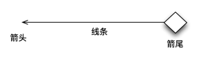
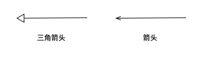
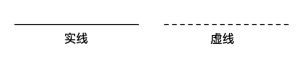
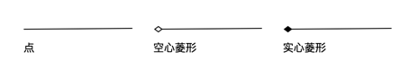
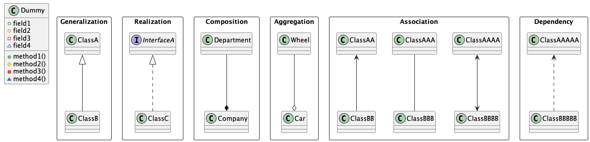

UML 类图解析和对应的 PlantUML 效果实现。

<!--more-->

## 可见性

| 符号 | 可见性    | 范围                 |
| ---- | --------- | -------------------- |
| +    | public    | 所有类可见           |
| #    | protected | 该类子孙可见         |
| -    | private   | 类本身可见           |
| ~    | package   | 同一包生命其他类可见 |

## 关系

| 关系 | 英文           | 关系强弱 |
| ---- | -------------- | -------- |
| 泛化 | Generalization | 6        |
| 实现 | Realization    | 5        |
| 组合 | Composition    | 4        |
| 聚合 | Aggregation    | 3        |
| 关联 | Association    | 2        |
| 依赖 | Dependency     | 1        |

### 关系符号基础

类图关系的符号由三部分组成：箭头、线条和箭尾：



箭头形状有两种，分别为箭头和三角箭头:



线条形状有两种，分别为实线和虚线:



箭尾形状有三种，分别为点、空心菱形和实心菱形:



### 符号优先级

整体：箭头 > 箭尾 > 线条

箭头：三角箭头 > 箭头

箭尾：实心菱形 > 空心菱形 > 点

线条：实线 > 虚线

| 组合            | 关系 | 英文           |
| --------------- | ---- | -------------- |
| 三角箭头 + 实线 | 泛化 | Generalization |
| 三角箭头 + 虚线 | 实现 | Realization    |
| 实心菱形 + 实线 | 组合 | Composition    |
| 实心菱形 + 虚线 | 聚合 | Aggregation    |
| 箭头 + 实线     | 关联 | Association    |
| 箭头 + 虚线     | 依赖 | Dependency     |

## 关系解析

### 泛化（继承） Generalization

```uml
ClassA <|-- ClassB
```

箭头指向：三角箭头 + 实线，**表示继承一个基类，ClassB 继承 ClassA**
泛化关系：是一种继承关系，表示一般与特殊的关系，它指定了子类如何特化父类的所有特征和行为

### 实现 Realization

```uml
interface InterfaceA
InterfaceA <|.. ClassC
```

箭头指向: 三角箭头 + 虚线,箭头指向接口，**表示 C 类实线接口定义**
实线关系: 类与接口的关系，表示类实现了接口的所有特征和行为

### 组合 Composition

```uml
Department --* Company
```

箭头方向: 实心菱形 + 实线，菱形指向整体
组合关系: 整体和部分的关系，**部分不能离开整体而单独存在**

### 聚合 Aggregation

```uml
Wheel --o Car
```

箭头方向: 空心菱形 + 实线, 菱形指向整体
聚合关系: 是整体和部分的关系，**部分可以离开整体单独存在**

### 关联 Association

```uml
ClassAA <-- ClassBB
ClassAAA -- ClassBBB
ClassAAAA <--> ClassBBBB
```

箭头方向：箭头 + 实线,指向被拥有着
关联关系：拥有关系，**一个类知道另一个类的特征和行为**
PS: 分为单向关联和双向关联，双向关联可以两个箭头，也可以不要箭头

### 依赖 Dependency

```uml
ClassAAAAA <.. ClassBBBBB
```

箭头方向：箭头 + 虚线，指向被使用者
依赖关系：使用关系，**一个类的实现需要另一个类的协助**

## PlantUML

效果：



代码：

```uml
@startuml

class Dummy {
 +field1
 #field2
 -field3
 ~field4
 +method1()
 #method2()
 -method3()
 ~method4()
}

package "Generalization" <<Rectangle>>{
  ClassA <|-- ClassB
}

package "Realization" <<Rectangle>>{
  interface InterfaceA
  InterfaceA <|.. ClassC
}

package "Composition" <<Rectangle>>{
  Department --* Company
}

package "Aggregation" <<Rectangle>>{
  Wheel --o Car
}

package "Association" <<Rectangle>>{
  ClassAA <-- ClassBB
  ClassAAA -- ClassBBB
  ClassAAAA <--> ClassBBBB
}

package "Dependency" <<Rectangle>>{
  ClassAAAAA <.. ClassBBBBB
}
@enduml
```
